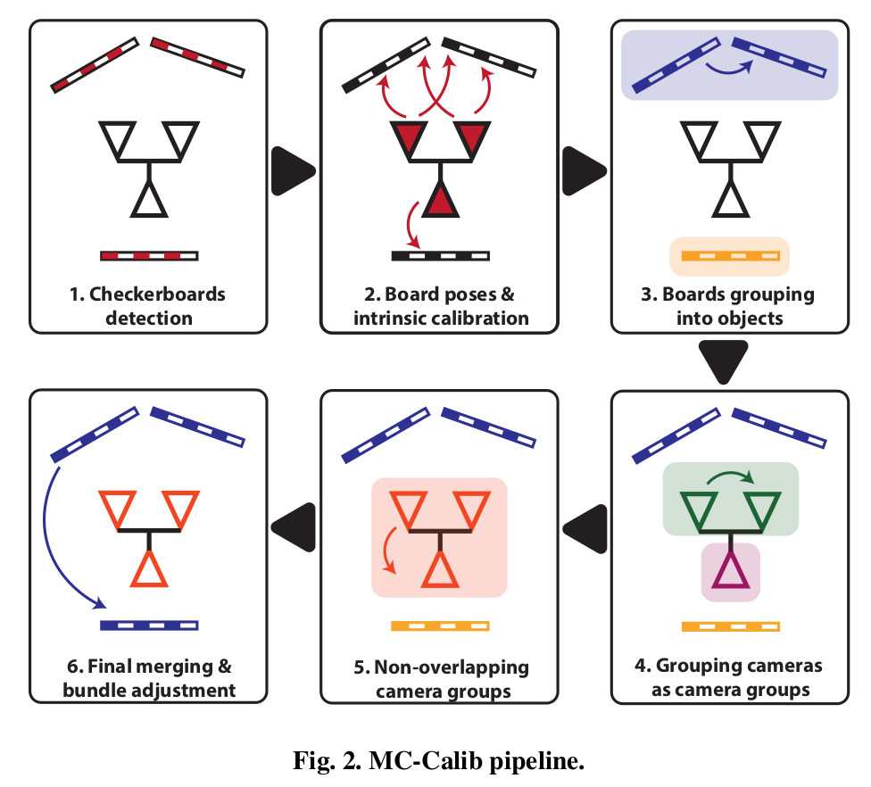
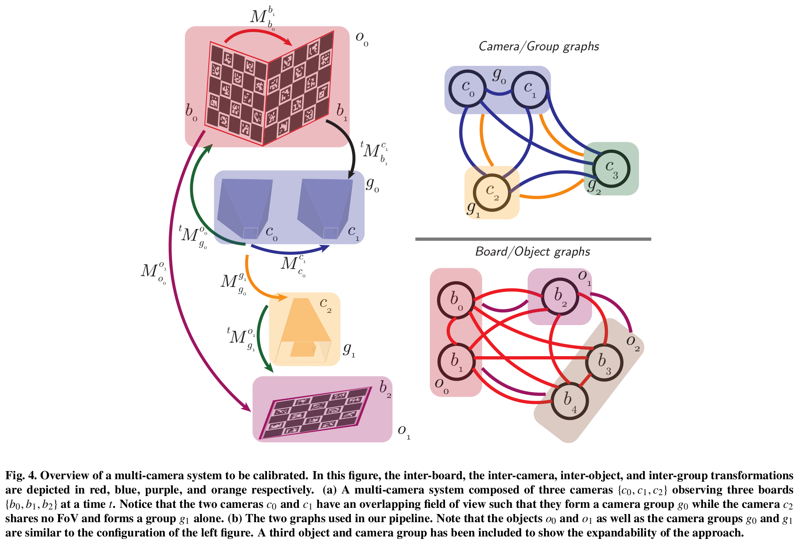
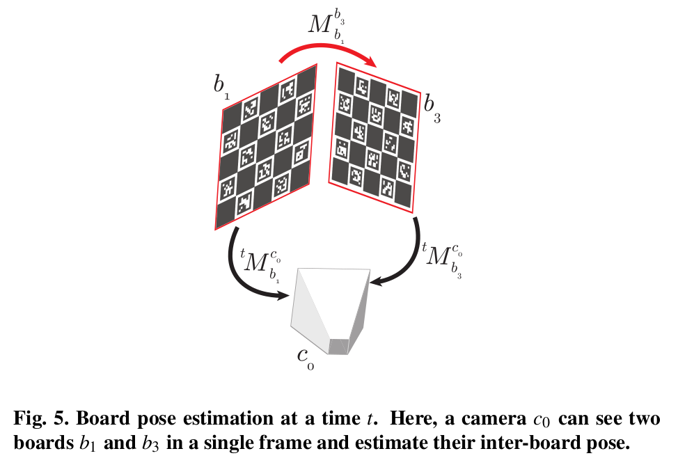
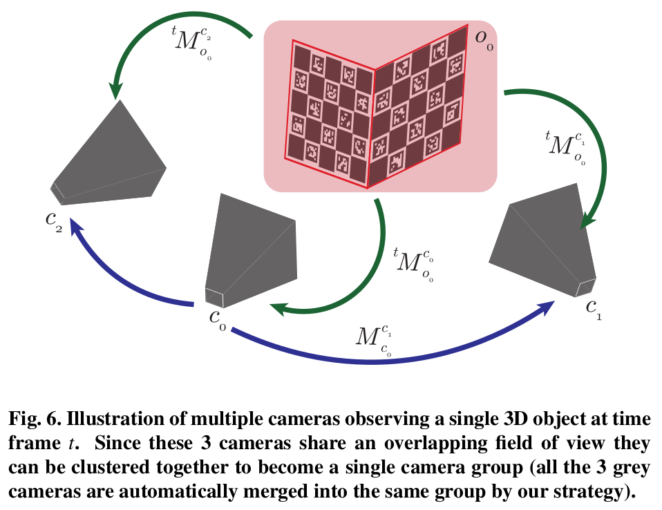
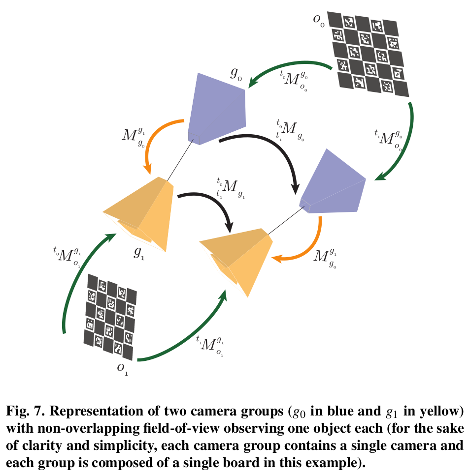

# 1\. 摘要

1.  MC-Calib：目的是通过任意数量的标定板来标定复杂的多相机系统。通过连续多阶段的优化得到可靠的系统中多个标定板之间的poses和多个相机之间的poses。
2.  不受相机数量限制、不受重叠区域限制、不受标定板数量限制
3.  不需要相机系统的先验信息或者标定板的位置信息

# 2\. 方法

## 2.1 概述

### 2.1.1 流程：

1.  内参和标定板之间的pose估计
    1.  被观测到的标定板用来标定每个相机的内参
    2.  如果一张图片中观测到了多个标定板，就计算标定板之间的pose，然后存储到graph中。假设这些标定板是固连的，这个graph用来连接所有有共视关系（在一张图片中被同时观测到）的标定板，形成3D标定objects。然后标定板之间的pose通过BA优化
2.  相机pose估计
    1.  计算每个相机相对3D objects的pose
    2.  通过重叠FoV，计算每两个相机之间的外参，通过非线性优化保证精度
    3.  这些相机对之间的连接关系可以表示成一个graph，按照相机是否连接分组（camera groups），并计算它们相对参考相机的pose
3.  不同camera groups之间pose的估计。相机之间没有重叠区域，导致出现多个camera groups，这种情况下使用hand-eye标定方法
4.  最后进行所有参数的联合BA优化：相机之间的poses、标定板之间的poses、内参

### 2.1.2 符号表示

| 符号  | 含义  |
| --- | --- |
| $N_c$ | 相机的数量 |
| $M_b$ | 标定板的数量 |
| $K_{c_i}，k_{c_i}$ | 第$i$个相机的内参和畸变 |
| $[R_{C_{ref}}^{C_i} \| t_{C_{ref}}^{C_i}]$ | 第$i$相机相对参考相机的外参 |
| $M_{C_{ref}}^{C_i}$ | 是$[R_{C_{ref}}^{C_i} \| t_{C_{ref}}^{C_i}]$的齐次表示形式 |
| $^{t}M_{b_j}^{C_i}$ | 在第$t$帧时，相机$c_i$ 相对 参考标定板$b_j$ 的pose |
| $o_0 = \{b_0,b_1\}$ | 表示由标定板$b_0和b_1$组成的第0个object |
| $^{t}M_{c_i}^{O_k}$ | 在第$t$帧时，object $O_k$ 相对 相机$c_i$的pose |
| $g_0 = \{c_0,c_1\}$ | 表示由相机$c_0和c_1$组成的第0个group |
| $M_{g_0}^{g_1}$ | group $g_1$ 相对 $g_2$的pose |
| $P_{b_j}^s$ | 第$b_j$个标定板上第$s$个3D点 |
| $^{t}_{c_i}p_{b_j}^s$ | $P_{b_j}^s$在第$c_i$个相机的第$j$帧的观测坐标 |

## 2.2 具体方法

### 2.2.1 标定板检测和关键点提取

处理所有图片，保存2D角点和相应的3D点（board坐标系下）。
使用Deltille Grids for Geometric Camera Calibration的方法优化角点
通过collinearity check避免退化的配置
可见角点数量低于百分比阈值的board就忽略掉（根据相机重叠区域大小来调整）

### 2.2.2 内参初始化

对于每个相机$c_i$，使用其所有图片的3D&lt;-&gt;2D对应点对计算初始的内参矩阵和畸变参数

1.  对于透视投影相机，使用张正友标定法，畸变模型假设为(Brown distortion model)
2.  对于鱼眼相机，使用OpenCV方法，畸变模型假设为(Kannalla distortion model)
    为了加快速度，每个相机只随机选择50个被观测的board。但是在下个阶段优化时，所有图片都会使用。
    对于很多不重叠相机配置，很难满足足够的有效视角，此时toolbox允许用户自己设置相机内参。
    toolbox可以支持混合使用鱼眼和透视相机。

### 2.2.3 标定板pose估计和内参优化

根据上面计算的初始的内参，估计所有相机相对每个被观测标定板的pose。
假设一张图片中包含两个标定板$b_1, b_3$，那么就会计算并保存两个变换矩阵$^{t}M_{b_1}^{C_0}$和$^{t}M_{b_3}^{C_0}$。计算方法为PnP，使用RANSAC剔除outliers。然后使用inliers通过LM非线性方法优化相机相对标定板的pose。重投影误差的目标函数如下：

$$
\min_{^t r_{b_j}^{c_i}, ^t t_{b_j}^{c_i}}\sum_{s=1}^{S} ||^t_{c_i}p_{b_j}^{s} - Proj(^tM_{b_j}^{c_i}P_{b_j}^{s}, K_{c_i}, k_{c_i})||^2

$$

其中，S是board上可见的点数。
有了初始的内参和外参估计，然后就是把相机$c_i$下所有帧的数据统一优化：

$$
\min_{^t r_{b_j}^{c_i}, ^t t_{b_j}^{c_i}, K_{c_i}, k_{c_i}}\sum_{t=1}^{T}\sum_{j=1}^{M_b}\sum_{s=1}^{S} ||^t_{c_i}p_{b_j}^{s} - Proj(^tM_{b_j}^{c_i}P_{b_j}^{s}, K_{c_i}, k_{c_i})||^H

$$

其中，$T和M_b$是图片数量和观测到的board的数量，$||\cdot||^H$表示Huber loss

### 2.2.4 把board组成object

在上面的计算中，已经得到了所有相机相对每一个board的pose，下面需要计算board之间的相对pose，并把它们组成一个3D object。如图5如果两个board在同一个图像中被看到，那么它们之间的pose可以计算：$^tM_{b_1}^{b_3} = (^tM_{b_3}^{c_0})^{-1} {^tM_{b_1}^{c_0}}$。
为了鲁棒性，相同的一对boards可能在多个图像中出现过，把所有图片的估计的pose进行平均。
为了构建3D object，把board之间的pose存储成一个有向带权图。对于每个object，选择编号最小的作为参考board。当3D object中包含两个以上boards时，使用Dijkstra最短路径算法确定最优的变换组合（表示一个board在object的参考board的pose），其中，边的权重用每对boards被观测次数的倒数表示。
为什么要使用Dijkstra最短路径算法？
每个board $b_i$到reference board $b_{ref}$的路径可能不止一条，比如$b_{ref}$到$b_5$的可能路径如下：（1）$b_{ref} \rightarrow b_2 \rightarrow b_4 \rightarrow b_3 \rightarrow b_5$；（2）$b_{ref} \rightarrow b_1 \rightarrow b_5$，那么$b_{ref}$到$b_5$的pose是通过（1）计算还是通过（2）计算？本文使用Dijkstra最短路径算法来确定最短的路径，路径上边的权重为这个board pair被看到的次数的倒数，权重最小的那条路径说明其中的board pair被观察到的次数最多，被观测次数越多，优化的结果越准确。
最后，每一个3D object使用如下重投影误差进行优化：

$$
\min_{r_{b_{ref}}^{b_j}, t_{b_{ref}}^{b_j}}\sum_{i=1}^{N_c}\sum_{j=1}^{M_b}\sum_{t=1}^{T}\sum_{s=1}^{S} ||^t_{c_i}p_{b_j}^{s} - Proj(^tM_{b_{ref}}^{c_i}M_{b_j}^{b_{ref}}P_{b_j}^{s}, K_{c_i}, k_{c_i})||^H

$$

### 2.2.5 对camera进行分组

在创建了3D objects之后，每一帧图像相机相对3D objects的pose可以通过PnP计算。如图6，在第 t 帧时，相机$c_2$相对object $o_0$的pose表示为$^tM_{o_0}^{c_2}$。由于这三个相机可以同时看到这个object，那么就可以把它们组成一个group $g_0=\{c_0, c_1, c_2\}$。对多个帧下，相机之间的pose进行平均。
一个group通过一个graph来表示，如图4中的表示。同样，作者希望把group中的camera表示在一个参考坐标系中，同样用Dijkstra方法确定。
最后，每一个group使用如下目标函数优化：

$$
\min_{r_{c_{ref}}^{c_i}, t_{c_{ref}}^{c_i}}\sum_{i=1}^{N_g}\sum_{k=1}^{M_o}\sum_{t=1}^{T}\sum_{s=1}^{S} ||^t_{c_i}p_{b_j}^{s} - Proj(M_{c_{ref}}^{c_i} {^tM_{o_k}^{c_{ref}}}P_{o_k}^{s}, K_{c_i}, k_{c_i})||^H

$$

其中，$N_g$是group中相机的数量，$M_o, S_o$分别是object数量和object中3D point的数量

### 2.2.6 不重叠camera group的估计（手眼标定）

假设group $g_0和g_1$分别观察到object $o_0和o_1$ 两帧$t_0, t_1$，两个group之间的关系为$M_{g_0}^{g_1}$，那么移动关系如下：

$$
^{t_1}_{t_0}M_{g_0} = ^{t_1}M_{0_o}^{g_0}{^{t_0}M_{g_0}^{o_0}} \tag{9}

$$

$$
^{t_1}_{t_0}M_{g_1} = ^{t_1}M_{0_o}^{g_1}{^{t_0}M_{g_1}^{o_0}}  \tag{10}

$$

对（9）和（10）分别左乘和右乘$M_{g_0}^{g_1}$，可得$^{t_1}_{t_0}M_{g_1} M_{g_0}^{g_1} = M_{g_0}^{g_1}{^{t_1}_{t_0}M_{g_0}}$
形如：$AX = XB$形式的系统，可以通过手眼标定的方法解（A new technique for fully autonomous and efficient 3 d robotics hand/eye calibration）
略。。。

### 2.2.7 合并camera groups以及BA

当不重叠相机groups的初始pose估计完成后，camera groups和objects被合并。最后，对整个系统（所有boards的相对位置，相机poses，内参）进行统一优化：

$$
\min_{r_{b_{ref}}^{b_j}, t_{b_{ref}}^{b_j}, r_{c_{ref}}^{b_i}, r_{c_{ref}}^{b_i}, K_{c_i}, k_{c_i}} = \sum_{1=1}^{N_c} \sum_{j=1}^{M_b} \sum_{t=1}^{T} \sum_{s=1}^{S} || ^t_{c_i}P_{b_j}^{s} - Proj(M_{c_i}^{c_{ref}} {^tM_{b_{ref}^{c_i}}} M_{b_j}^{b_{ref}} P_{b_j}^{s}, K_{c_i}, k_{c_i}) ||^H \tag{14}

$$