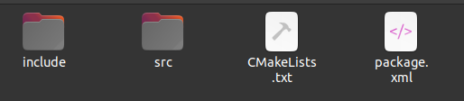
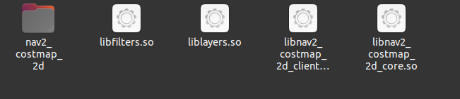
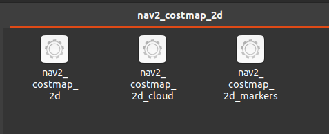

转载：https://www.guyuehome.com/38615
参考：http://docs.ros.org/en/humble/How-To-Guides/Ament-CMake-Documentation.html

ROS2的构建系统ament_cmake是基于CMake改进而来的。本篇文章我们详细介绍一下ament_cmake常用的语句。

## 一个功能包的诞生
使用ros2 pkg create <package_name>可以生成一个功能包的框架。

一个功能包的构建信息将会包含在CMakeLists.txt和package.xml这两个文件中。package.xml文件中包含该功能包的依赖信息，它可以帮助编译工具colcon确定多个功能包编译的顺序。当我们需要单独编译功能包时必须确保编译的包名必须与package.xml文件中的一致。
```
colcon build --packages-select <package_name>
```
而CMakeLists.txt就是我们需要重点关注的。它描述了如何构建功能包。

## 详细分析一个功能包的CMakeList.txt
下面找到一个比较有代表性的功能包（nav2_costmap_2d）的CMakeList.txt来作分析。
```
cmake_minimum_required(VERSION 3.5)
project(nav2_costmap_2d)
```
第一条语句指定了cmake的最低版本，第二条语句设定了构建的功能包名称。注意，这个名称必须和package.xml中的名称保持一致。

---

```
find_package(ament_cmake REQUIRED)
find_package(geometry_msgs REQUIRED)
find_package(laser_geometry REQUIRED)
find_package(map_msgs REQUIRED)
find_package(message_filters REQUIRED)
find_package(nav2_common REQUIRED)
find_package(nav2_msgs REQUIRED)
find_package(nav2_util REQUIRED)
find_package(nav2_voxel_grid REQUIRED)
find_package(nav_msgs REQUIRED)
find_package(pluginlib REQUIRED)
find_package(rclcpp REQUIRED)
find_package(rclcpp_lifecycle REQUIRED)
find_package(rmw REQUIRED)
find_package(sensor_msgs REQUIRED)
find_package(std_msgs REQUIRED)
find_package(tf2_geometry_msgs REQUIRED)
find_package(tf2 REQUIRED)
find_package(tf2_ros REQUIRED)
find_package(tf2_sensor_msgs REQUIRED)
find_package(visualization_msgs REQUIRED)
find_package(angles REQUIRED)
```
查找系统中的依赖项。另外在构建库或执行文件时需要添加这些依赖项。

-----

```
find_package(Eigen3 REQUIRED)
include_directories(
  include
  ${EIGEN3_INCLUDE_DIRS}
)
```
添加非ROS2功能包的依赖项时，需要将其对于的头文件路径在include_directories中写明。而对于依赖项为ROS2功能包时，则无需此操作。

---

```
add_library(nav2_costmap_2d_core SHARED
  src/array_parser.cpp
  src/costmap_2d.cpp
  src/layer.cpp
  src/layered_costmap.cpp
  src/costmap_2d_ros.cpp
  src/costmap_2d_publisher.cpp
  src/costmap_math.cpp
  src/footprint.cpp
  src/costmap_layer.cpp
  src/observation_buffer.cpp
  src/clear_costmap_service.cpp
  src/footprint_collision_checker.cpp
  src/costmap_collision_checker.cpp
  src/costmap_collision_checker_ros.cpp
  plugins/costmap_filters/costmap_filter.cpp
)

set(dependencies
  geometry_msgs
  laser_geometry
  map_msgs
  message_filters
  nav2_msgs
  nav2_util
  nav2_voxel_grid
  nav_msgs
  pluginlib
  rclcpp
  rclcpp_lifecycle
  sensor_msgs
  std_msgs
  tf2
  tf2_geometry_msgs
  tf2_ros
  tf2_sensor_msgs
  visualization_msgs
  angles
)

ament_target_dependencies(nav2_costmap_2d_core
  ${dependencies}
)

add_library(layers SHARED
  plugins/inflation_layer.cpp
  plugins/static_layer.cpp
  plugins/obstacle_layer.cpp
  src/observation_buffer.cpp
  plugins/voxel_layer.cpp
  plugins/range_sensor_layer.cpp
)
ament_target_dependencies(layers
  ${dependencies}
)
target_link_libraries(layers
  nav2_costmap_2d_core
)

add_library(filters SHARED
  plugins/costmap_filters/keepout_filter.cpp
  plugins/costmap_filters/speed_filter.cpp
)
ament_target_dependencies(filters
  ${dependencies}
)
target_link_libraries(filters
  nav2_costmap_2d_core
)

add_library(nav2_costmap_2d_client SHARED
  src/footprint_subscriber.cpp
  src/costmap_subscriber.cpp
  src/costmap_topic_collision_checker.cpp
)

ament_target_dependencies(nav2_costmap_2d_client
  ${dependencies}
)

target_link_libraries(nav2_costmap_2d_client
  nav2_costmap_2d_core
)
```
add_library语句用于构建库。可以看到，上面使用了两个不同的语句来添加依赖。ament_target_dependencies是官方推荐的方式去添加依赖项。它将使依赖项的库、头文件和自身的依赖项被正常找到。
通常来说，若依赖项为ROS2功能包时，则使用ament_target_dependencies。若功能包有多个库，它也将一并包含。
target_link_libraries添加依赖项目时需写明具体库的名称。也就是说，添加的每一条都是一个库。比如上面的nav2_costmap_2d_core就是添加了libnav2_costmap_2d_core.so库。

---

```
add_executable(nav2_costmap_2d_markers src/costmap_2d_markers.cpp)
target_link_libraries(nav2_costmap_2d_markers
  nav2_costmap_2d_core
)

ament_target_dependencies(nav2_costmap_2d_markers
  ${dependencies}
)

add_executable(nav2_costmap_2d_cloud src/costmap_2d_cloud.cpp)
target_link_libraries(nav2_costmap_2d_cloud
  nav2_costmap_2d_core
)

add_executable(nav2_costmap_2d src/costmap_2d_node.cpp)
ament_target_dependencies(nav2_costmap_2d
  ${dependencies}
)

target_link_libraries(nav2_costmap_2d
  nav2_costmap_2d_core
  layers
  filters
)
```
add_executable用于构建执行文件。它添加依赖的方式与上面构建库添加依赖的方式是一样的。

---
```
install(TARGETS
  nav2_costmap_2d_core
  layers
  filters
  nav2_costmap_2d_client
  ARCHIVE DESTINATION lib
  LIBRARY DESTINATION lib
  RUNTIME DESTINATION bin
)
```
安装库的语句。它将在install/nav2_costmap_2d/lib安装库文件。其效果如下：


---
```
install(TARGETS
  nav2_costmap_2d
  nav2_costmap_2d_markers
  nav2_costmap_2d_cloud
  RUNTIME DESTINATION lib/${PROJECT_NAME}
)
```
这里安装的是执行文件。安装路径是install/nav2_costmap_2d/lib/nav2_costmap_2d。其效果如下：


---
```
install(FILES costmap_plugins.xml
  DESTINATION share/${PROJECT_NAME}
)

install(DIRECTORY include/
  DESTINATION include/
)
```
安装其他文件。若需要安装launch文件和参数文件也可以在此处添加。如下所示：
```
install(
  DIRECTORY include launch params
  DESTINATION share/${PROJECT_NAME}
)
```

---
```
if(BUILD_TESTING)
  find_package(ament_lint_auto REQUIRED)
  # the following line skips the linter which checks for copyrights
  set(ament_cmake_copyright_FOUND TRUE)
  set(ament_cmake_cpplint_FOUND TRUE)
  ament_lint_auto_find_test_dependencies()

  find_package(ament_cmake_gtest REQUIRED)
  add_subdirectory(test)
endif()
```
上面是编译test目录下的单元测试文件。

---
```
ament_export_include_directories(include)
```
这条语句标记该功能包的头文件位置，以便其他功能包要依赖该功能包时能顺利找到对应的头文件。

---
```
ament_export_libraries(layers filters nav2_costmap_2d_core nav2_costmap_2d_client)
```
一个ros2功能包中可能存在多个库。如果希望其他的功能包能链接到这些库必须使用上面语句声明这些库。

声明好后，其他功能包要链接这些库时只需
```
find_package(nav2_costmap_2d REQUIRED)

ament_target_dependencies(example_node
  nav2_costmap_2d
)
```

---
```
ament_export_dependencies(${dependencies})
```
ament_export_dependencies会将依赖项导出到下游软件包。这是必需的，这样该库使用者也就不必为那些依赖项调用find_package了。

---
```
pluginlib_export_plugin_description_file(nav2_costmap_2d costmap_plugins.xml)
```
导出插件的描述文件以便pluginlib::ClassLoader类可以找到相应的插件。

---
```
ament_package()
```
项目安装是通过ament_package（）完成的，并且每个软件包必须恰好执行一次这个调用。ament_package()会安装package.xml文件，用ament索引注册该软件包，并安装CMake的配置（和可能的目标）文件，以便其他软件包可以用find_package找到该软件包。由于ament_package()会从CMakeLists.txt文件中收集大量信息，因此它应该是CMakeLists.txt文件中的最后一个调用。