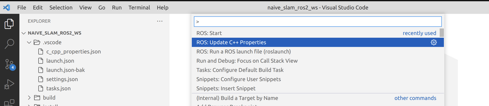
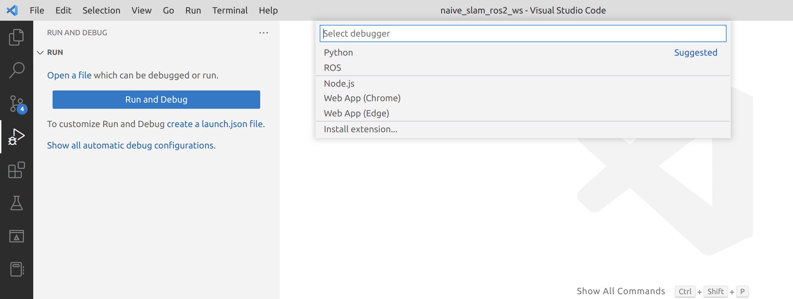
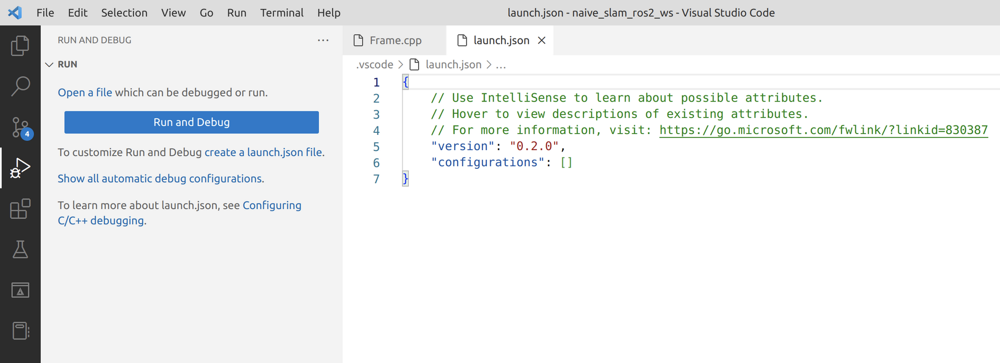
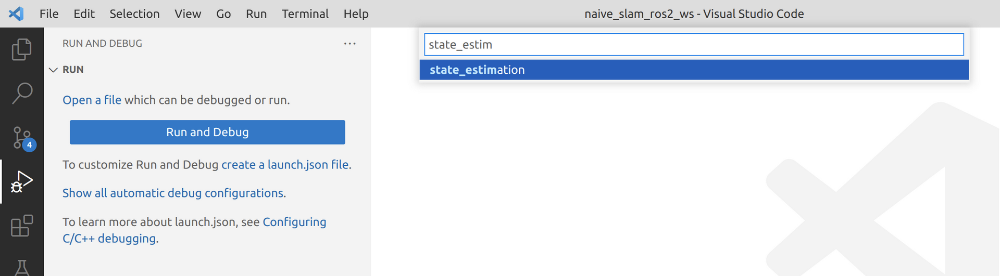
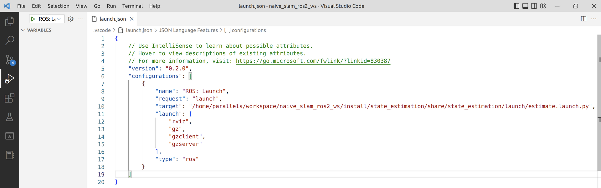

# 1\. 参考视频：

https://www.youtube.com/watch?v=uqqHgYsskJI&list=PL2dJBq8ig-vihvDVw-D5zAYOArTMIX0FA&index=7

# 2\. 配置步骤

1.  写好ros2 的 launch 文件，launch文件放在需要调试的package中的launch文件夹中。
官方文档：https://docs.ros.org/en/humble/How-To-Guides/Launch-file-different-formats.html
    
2.  为了让vscode能够找到 launch 文件，需要把launch文件安装一下，在CMakeLists.txt中添加下列代码：
    
    ```
    install(
      DIRECTORY launch
      DESTINATION share/${PROJECT_NAME}
    )
    ```
    
3.  配置vscode。首先把ROS2 的 daemon 关掉，如果daemon事先在外部命令行中开启了，在vscode中运行调试时，会出现“ROS2 daemon timeout”的错误提示，使用下列命令关闭：
    
    ```
    ros2 daemon stop
    ```
    
4.  然后按“ ctrl + shift + p”，选择 “ROS: Update C++ Properties"，配置ROS2，会更新.vscode/c\_cpp\_properties.json文件，如下图
    
    
5.  把vscode中打开的编辑页面都关掉，然后点Activity Bar中”Run and debug“按钮，配置调试的launch.json文件。当所有编辑页面都关闭时，点击”create a launch.json file“，“Select debugger”的选项中会直接出现”ROS“选项。但是如果有打开的编辑页面，则会直接生成空的launch.json文件。如下图
    
    
    
6.  选择第5步中的”ROS“后，会一步步引导选择一个package（即需要debug的package），然后再选择这个package中的一个ROS2 launch文件，vscode会根据这个package中的ROS2 launch文件产生launch.json文件。
    
    
    
    可以看出，这个launch.json文件包含了上面选择的ROS2 launch文件的绝对路径
    
7.  然后点击”debug“按钮就可以调试了。一开始debug运行的速度会比较慢，因为需要把ROS2的msgs封装传输，并且gdb也需要进行一些配置等等。