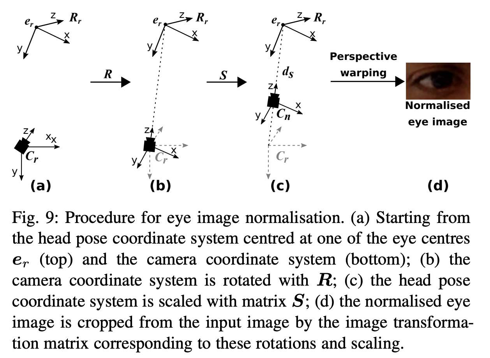

Normalization目的是降低模型学习的难度。现实中，人脸在相机坐标系的位姿是任意的，包括距离的远近、左右平移、抬头低头、左右转头、左右摆头，所以有六个自由度的变化（X, Y, Z, pitch, yaw, roll）。相应的眼睛也有这些变化，其中位置变化容易理解，角度变化并不直接。   
我们最终需要的是一个三维空间中的视线向量。视线向量指示的是一个空间中的方向，不需要关注其长度，所以它有两个自由度，这个向量可以在三维坐标系中用水平角和竖直角表示。        
但是通过一张拍摄的图片估计视线，却是把视线向量和人头位姿耦合在一起了，因为眼球只会左右移动和上下移动，并不会旋转。但是眼球却是因为人头的旋转而旋转，也会随着人头的移动而移动。眼球和人头互相独立的运动
     
# Normalization的思路：
1. 假设眼睛区域是平面，那么相机的旋转和缩放都可以对应到图像的透视变换上。那么模型需要估计的就只有两个自由度了。
2. Normalization之后的图像满足一下条件：
	1. 虚拟相机看向人头坐标系的原点：这个原点定义在眼睛中心。所以在Normalized的图像中，眼睛位于图像中心。
	2. 人头坐标系的X 轴和虚拟相机的X轴位于同一个平面上
	3. 虚拟相机到眼睛的距离是固定的。
3. 步骤：
 
	1. 已知人头坐标系相对相机坐标系的位姿为R和t，可以把眼睛的3D坐标转换到相机坐标系中。
	2. 虚拟相机的坐标系的Z轴指向眼睛中心，则Z轴的方向为原相机原点到眼睛的方向；
	3. 人头和虚拟相机的X轴在同一个平面上，则首先虚拟相机的Y轴要垂直于虚拟相机的Z轴和人头坐标系的X轴，然后虚拟相机的X轴垂直于虚拟相机的Y轴和Z轴。
	4. 根据虚拟相机三个轴的方向，可以定义出虚拟相机相对原相机的旋转矩阵R。然后把虚拟相机沿着Z轴平移到距离眼睛固定位置处，通过缩放系数S表示。则最后的变换为M= SR，这个矩阵可以用来把视线向量从原相机坐标系转换到虚拟相机坐标系。而由于缩放对于向量的表示没有影响，所以不用考虑S，向量变换只需要用到R。
	5. 对图像进行变换。对图像的变换需要考虑到缩放的影响。透视投影矩阵为:
	   $$W = C_nMC^{-1}$$

	