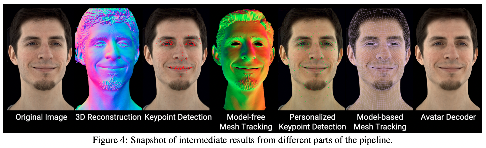
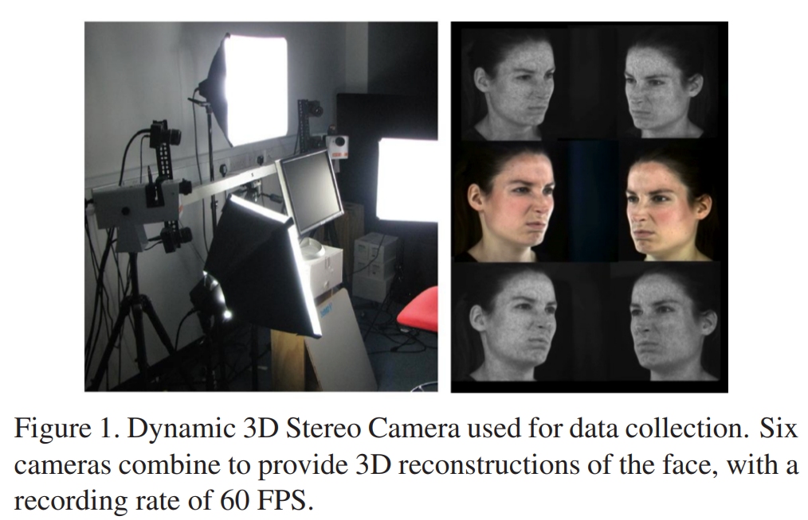

# 1\. Multiface

## 1.1 设备

1.  sensor：IMX253，像元：3.45um，采集分辨率：4096x2668，公开的分辨率：2048x1334，曝光速度：2.222ms
2.  光源：很多点光源，安装了扩散器，减少镜面高光，使得更接近均匀照明。

## 1.2 采集内容

1.  表情
2.  视线方向
3.  50个语音平衡的句子：phonetically balanced sentences

## 1.3 数据处理过程

1.  使用改进的parallel Patchmatch(Massively parallel multiview stereopsis by surface normal diffusion)对每一帧进行稠密3D mesh重建。不同帧的3D mesh topology是不同的
2.  然后再每一帧序列中，使用图片、关键点、稠密3D mesh作为输入，用无模型mesh跟踪方法（Constraining dense hand surface tracking with elasticity.）来获得相对应跟踪meshes。由于计算耗时，所以只在表情和视线序列中进行跟踪，句子序列不跟踪
3.  根据跟踪结果，生成个性化的关键点检测训练数据。这些关键点不只是能够手工标注的，也包括脸颊、额头。
4.  这些关键点用来训练一个个性化的关键点检测器，这个检测器的结果作为PCA 基于模型的mesh追踪方法的初始化。使用个性化关键点和PCA model-based跟踪的优点：不再需要序列追踪，所有帧都可以并行跟踪，减少计算量，更加高效的处理全部的capture（这里应该是包括50个句子数据）。
5.  一旦有了跟踪的mesh和每个视角下的一张图片，把那个具体视角下的texture展平来获得编码头像生成的所有必须数据。
    流程如下图：
    
	
## 1.4 数据集总结（共13个采集对象）
1. **Raw images**：v1有40个cameras，v2有160个cameras，帧率30fps，分辨率2048x1334。原始图像可以用作真值，在训练模型时计算被预测出的渲染图像的screen loss
2. **Unwrapped Textures**：分辨率：1024 × 1024。使用barycentric插值的方法把每个mesh三角形折叠到对应的UV texture三角形上。每个camera的每一帧都有一个独立的与视角相关的unwrapped textures
3. **Tracked Meshes**：每一帧有一个tracked mesh，用.obj文件保存。Mesh包含7306个顶点，眼睛和嘴巴中没有顶点。所有meshes的topology是一样的，根据相机标定和头部姿态进行投影后，meshes可以对齐到raw images
4. **Headposes**：3x4的变换矩阵，表示Head mesh在每一帧的位姿
5. **Audio**：50个句子的数据
6. **Metadata**：
	1. camera calibrations：每个相机的内参和外参
	2. frame list：所有帧的一个list文件，包含名称和frame index
	3. texture mean：所有相机的所有帧的平均texture
	4. vertex mean：所有相机的所有帧的mesh的顶点的平均
	5. vertex variance：方差

# 2. FaMos
## 2.1 设备
1. 使用商业采集系统：3dMD LLC, Atlanta
2. 8对灰度双目相机、8个彩色相机，一共24个相机
采集系统是经过标定的，提供了相机内参、外参、径向畸变参数
3. 图像分辨率：1600x1200，帧率：60 fps
4. 彩色相机与LED灯面板时间同步
5. 双目相机与随机speckle pattern projectors（散斑图案投影仪）同步
使用MVS方法，根据双目图片，在帧率60 fps下重建无结构3D 扫描数据，每个scans包含110K个顶点
## 2.2 数据集总结
1. FaMos共包含95个采集对象
2. 每个对象包含28个运动序列
3. 包括6个典型表情（愤怒、厌恶、恐惧、高兴、悲伤、惊讶）、两个头部旋转（左右、上下）、多种面部运动（包括极端和不对称的表情）
4. 所有采集对象都带着发网（不是披散着头发）
5. 数据量：600k 帧（每个序列大概有225 frames），对应的3D head scans
6. 男女：41/52
7. 年龄：18-34：65； 35-50：14； 51-69：13； 70~：1
8. 地域：中东：6； 南美：10； 亚洲：24； 大洋洲：1； 非洲：3； 欧洲：49

# 3. D3DFACS
## 3.1 设备
1. 使用商业采集系统：3dMD LLC, Atlanta
2. 2对灰度双目相机、2个彩色相机，一共6个相机，帧率 60 fps
3. 包含obj格式的3D mesh，包含两个半脸的half-face meshes；和bmp格式的彩色UV texture map
4. mesh包含大约30K个顶点
5. UV texture map的大小为1024x1280
 
 
 ## 3.2 数据集（共10个采集对象）
 1. 每个sequence包含5~10 秒的数据，每个采集对象需要采集2~8小时
 2. 总共519个AU序列
 3. 每个序列包含大约 90 帧

# 4. CoMA
## 4.1 设备
1. 使用商业采集系统：3dMD LLC, Atlanta
2. 6对灰度双目相机、6个彩色相机，一共18个相机，5个speckle projectors，帧率 60 fps
## 4.2 数据集（共12个采集对象）
1. 总共20466个mesh，每个mesh包含120000个顶点
2. 使用FLAME进行对齐，顶点下采样到5023个
3. 包含12中极端的、复杂也不对称的表情