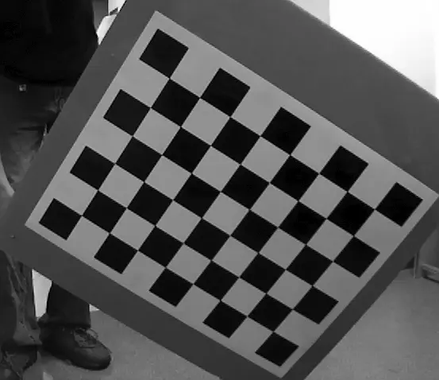
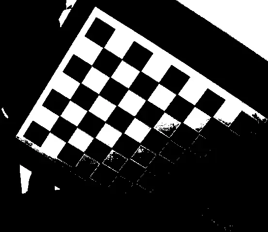
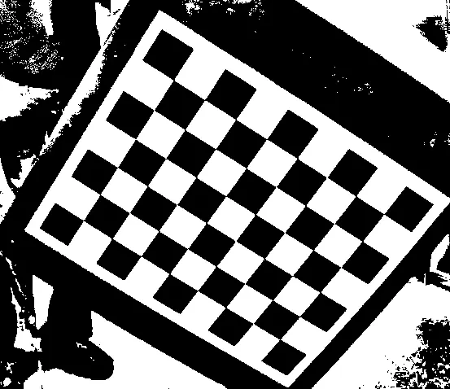
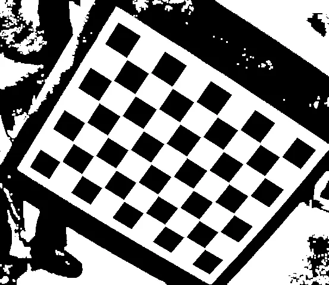
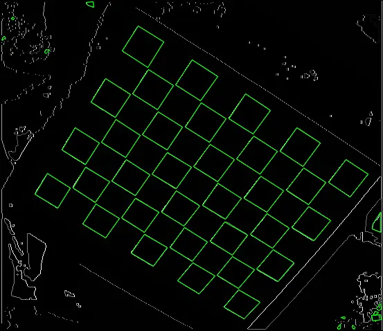
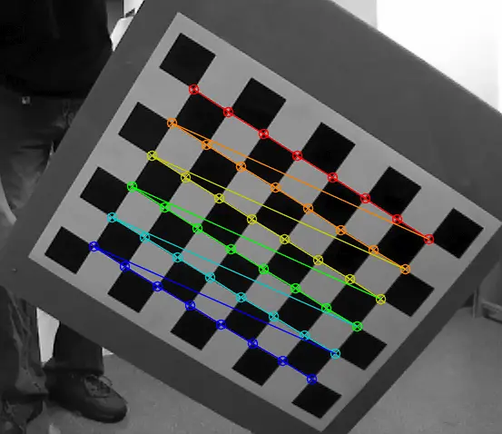

# opencv棋盘格角点检测原理总结

  
图1 ：原始图片

## 棋盘格检测的基本流程
1. 第一步，局部平均自适应阈值化方法对亮度不均匀情况适应性强，因此用该方法对图像二值化，均衡化后得到了理想的门限，效果如图2所示。  
  


2. 第二步，图像膨胀分离各个黑块四边形的衔接，由于膨胀的是白色像素点，因此能够缩小黑块四边形，断掉衔接，效果如图3所示。  


3. 第三步，检测四边形，计算每个轮廓的凸包，多边形检测，以及判断是否只有四个顶点，若是则为四边形，再用长宽比、周长和面积等约束去除一些干扰四边形，效果如图4所示。  


4. 第四步，将每个四边形作为一个单元，它分别有邻近的四边形，无邻近四边形的为干扰四边形，两个邻近四边形为边界处四边形，四个邻近四边形为内部四边形。每个四边形的序号可按邻近关系排序，然后按对角两个四边形相对的两个点，取其连线的中间点作为角点， 效果如图5 所示。  


整个棋盘定位过程是一个循环过程，先对读入的棋盘图像直方图均衡化，接着自适应(取决于flag参数)二值化，再对二值化后的图像膨胀。为了定位的鲁棒性，自适应二值化和膨胀所采用核的大小不能是唯一的，故不断的循环用不同的参数用对棋盘图像处理，膨胀所采用核的大小逐渐变大。

## 在每次的循环过程都需要，经过以下步骤。

1. 在二值化后图像外围画一白色的矩形框(方便轮廓提取)，然后进行轮廓提取cvFindContours。经过膨胀后的二值图像，每个黑色的方格已经被分开，轮廓提取后可以得到每个方格的轮廓，当然还有很多干扰轮廓。对轮廓进行多边形拟合cvApproxPoly，排除不是矩形的轮廓，利用矩形的其他性质，再排除一些干扰轮廓。这些工作主要由icvGenerateQuads函数完成。

2. 寻找每个方格的相邻方格，并记相邻方格的个数，连同相邻方格的信息存在相应CvCBQuad结构体中。二值图像在膨胀后原本相邻的方格，分开了，原来相连部分有一个公共点，现在分开变成了两个点。找到相邻的方格之后，计算出原来的公共点，用公共点替代膨胀后分开的点。这主要由icvFindQuadNeighborhors函数完成。

3. 对所有“方格”(包括被误判的)分类，分类的原则是类内所有方格是相邻的。由icvFindConnectedQuads函数完成。

4. 根据已知所求的角点个数，判别每个类中方格是否为所求的棋盘方格，并对棋盘方格排序，即该方格位于哪行那列。在这个过程中，可以添加每类方格总缺少的方格，也可以删除每类方格中多余的方格。icvOrderFoundConnetedQuads函数完成该过程。

5. icvCleanFoundConnectedQuads函数、icvCheckQuadGroup函数根据已知棋盘的方格个数(由棋盘的角点数计算出来)确认方格位置及个数是否正确，并确定粗略强角点的位置(两个方格的相连位置)。icvCheckBoardMonotony再次检验棋盘方格是否提取正确。

6. 以上如果有一步所有方格都不符合要求，则进入一个新的循环。若循环结束，还尚未找到符合要求的方格，则棋盘定位失败，退出函数。

7. cvFindCornerSubpix()根据上步的强角点位置，确定强角点的精确位置。

```
bool cv::findChessboardCorners ( InputArray image, Size patternSize, OutputArray corners, int flags = CALIB_CB_ADAPTIVE_THRESH+CALIB_CB_NORMALIZE_IMAGE)
```

这个函数用来检测一幅图像中是否含有棋盘格，如果图像中不含有指定数目的棋盘格角点（即黑色方块相交的点为角点，因此制作标定板时，最好选用大一点白色或浅色木板作为棋盘格背景）或对它们排序失败时，函数返回0; 如果图像中棋盘格内部角点都被确定了位置并准确排列的话，该函数将它们按制定行列排序并存储在corners向量中。该函数确定的角点的大概位置（approximate），如果想更准确地确定角点的位置，你可以该函数检测角点成功后继续调用cornerSubPix函数。

参数：

image：8位灰度图像或彩色图像。

patternSizeNumber： 棋盘格内部角点的行和列，( patternSize = cvSize(points_per_row, points_per_colum) = cvSize(columns,rows) )。

cornersOutput：检测到的角点存储的数组，

flags：棋盘格检测角点方法设置标置位

CALIB_CB_ADAPTIVE_THRESH 使用自适应阈值将灰度图像转化为二值图像，而不是固定的由图像的平均亮度计算出来的阈值  
CALIB_CB_NORMALIZE_IMAGE 在利用固定阈值或者自适应的阈值进行二值化之前，先使用equalizeHist来均衡化图像gamma值。  
CALIB_CB_FILTER_QUADS 使用其他的准则（如轮廓面积，周长，类似方形的形状）来去除在轮廓检测阶段检测到的错误方块。  
CALIB_CB_FAST_CHECK 在图像上快速检测一下棋盘格角点，如果没有棋盘格焦点被发现，绕过其它费时的函数调用，这可以在图像没有棋盘格被观测以及恶劣情况下缩短整个函数执行时间。  

## 示例
检测棋盘格角点并在图像中画出来的例子：  
```
Size patternsize(8,6); //interior number of corners

Mat gray = ....; //source image

vector <point2f>corners; //this will be filled by the detected corners</point2f>

// CALIB_CB_FAST_CHECK saves a lot of time on images that do not contain any chessboard corners

bool patternfound = findChessboardCorners(gray, patternsize, corners, CALIB_CB_ADAPTIVE_THRESH + CALIB_CB_NORMALIZE_IMAGE + CALIB_CB_FAST_CHECK);

if(patternfound)

cornerSubPix(gray, corners, Size(11, 11), Size(-1, -1), TermCriteria(CV_TERMCRIT_EPS + CV_TERMCRIT_ITER, 30, 0.1));

drawChessboardCorners(img, patternsize, Mat(corners), patternfound);
```


## OpenCV findChessboardCorners 实现代码阅读, 主要实现在calibinit.cpp
```
bool cv::findChessboardCorners( InputArray _image, Size patternSize, OutputArray corners, int flags ){

CV_INSTRUMENT_REGION()

int count = patternSize.area()*2;

std::vector<Point2f> tmpcorners(count+1);

Mat image = _image.getMat(); 

CvMat c_image = image;

bool ok = cvFindChessboardCorners(&c_image, patternSize, (CvPoint2D32f*)&tmpcorners[0], &count, flags ) > 0;

if( count > 0 ) {

    tmpcorners.resize(count);

    Mat(tmpcorners).copyTo(corners);

}

else

    corners.release();

return ok;

}
```

InputArray和OutputArray两个类都是代理数据类型，用来接收Mat和Vector<>作为输入参数，OutputArray继承自InputArray。

InputArray作为输入参数的时候，传入的参数加了const限定符，即它只接收参数作为纯输入参数，无法更改输入参数的内容。而OutputArray则没有加入限定符，可以对参数的内容进行更改。

InputArray这个接口类可以是$Mat、Mat_<t>、Mat_<T, m, n>、vector<t>、vector<vector<t>>、vector<mat>$。也就意味着如果看见函数的参数类型是InputArray型时，把上诉几种类型作为参数都是可以的。这个类只能作为函数的形参参数使用，不要试图声明一个InputArray类型的变量，可以用cv::Mat()或cv::noArray()作为空参。在函数的内部可以使用InputArray::getMat()函数将传入的参数转换为Mat的结构，方便函数内的操作。可能还需要InputArray::kind()用来区分Mat结构或者vector<>结构.
```
CV_IMPL int cvFindChessboardCorners( const void\* arr, CvSize pattern_size,

                         CvPoint2D32f* out_corners, int* out_corner_count,  int flags )

{

int found = 0;    CvCBQuad *quads = 0;    CvCBCorner *corners = 0;

cv::Ptr<CvMemStorage> storage;

try{

int k = 0;    const int min_dilations = 0;    const int max_dilations = 7;

if( out_corner_count )

    *out_corner_count = 0;

Mat img = cvarrToMat((CvMat*)arr).clone();

if( img.depth() != CV_8U || (img.channels() != 1 && img.channels() != 3) )

  CV_Error( CV_StsUnsupportedFormat, "Only 8-bit grayscale or color images are supported" );

if( pattern_size.width <= 2 || pattern_size.height <= 2 )

    CV_Error( CV_StsOutOfRange, "Both width and height of the pattern should have bigger than 2" );

if( !out_corners )

    CV_Error( CV_StsNullPtr, "Null pointer to corners" );

if (img.channels() != 1)  cvtColor(img, img, COLOR_BGR2GRAY);

Mat thresh_img_new = img.clone();

icvBinarizationHistogramBased( thresh_img_new ); // process image in-place

SHOW("New binarization", thresh_img_new);

if( flags & CV_CALIB_CB_FAST_CHECK)

{

    //perform new method for checking chessboard using a binary image.

    //image is binarised using a threshold dependent on the image histogram

    if (checkChessboardBinary(thresh_img_new, pattern_size) <= 0) //fall back to the old method

    {

        if (checkChessboard(img, pattern_size) <= 0)

        {

            return found;

        }

    }

}

storage.reset(cvCreateMemStorage(0));

int prev_sqr_size = 0;

// Try our standard "1" dilation, but if the pattern is not found, iterate the whole procedure with higher dilations.

// This is necessary because some squares simply do not separate properly with a single dilation.  However,

// we want to use the minimum number of dilations possible since dilations cause the squares to become smaller,

// making it difficult to detect smaller squares.

for( int dilations = min_dilations; dilations <= max_dilations; dilations++ )

{

    if (found)

        break;      // already found it

    //USE BINARY IMAGE COMPUTED USING icvBinarizationHistogramBased METHOD

    dilate( thresh_img_new, thresh_img_new, Mat(), Point(-1, -1), 1 );

    // So we can find rectangles that go to the edge, we draw a white line around the image edge.

    // Otherwise FindContours will miss those clipped rectangle contours.

    // The border color will be the image mean, because otherwise we risk screwing up filters like cvSmooth()...

    rectangle( thresh_img_new, Point(0,0), Point(thresh_img_new.cols-1, thresh_img_new.rows-1), Scalar(255,255,255), 3, LINE_8);

    int max_quad_buf_size = 0;

    cvFree(&quads);

    cvFree(&corners);

    int quad_count = icvGenerateQuads( &quads, &corners, storage, thresh_img_new, flags, &max_quad_buf_size );

    PRINTF("Quad count: %d/%d\n", quad_count, (pattern_size.width/2+1)*(pattern_size.height/2+1));

    SHOW_QUADS("New quads", thresh_img_new, quads, quad_count);

    if (processQuads(quads, quad_count, pattern_size, max_quad_buf_size, storage, corners, out_corners, out_corner_count, prev_sqr_size))

        found = 1;

}

PRINTF("Chessboard detection result 0: %d\n", found);

// revert to old, slower, method if detection failed

if (!found)

{

    if( flags & CV_CALIB_CB_NORMALIZE_IMAGE )

    {

        equalizeHist( img, img );

    }

    Mat thresh_img;

    prev_sqr_size = 0;

    PRINTF("Fallback to old algorithm\n");

    const bool useAdaptive = flags & CV_CALIB_CB_ADAPTIVE_THRESH;

    if (!useAdaptive)

    {

        // empiric threshold level

        // thresholding performed here and not inside the cycle to save processing time

        double mean = cv::mean(img).val[0];

        int thresh_level = MAX(cvRound( mean - 10 ), 10);

        threshold( img, thresh_img, thresh_level, 255, THRESH_BINARY );

    }

    //if flag CV_CALIB_CB_ADAPTIVE_THRESH is not set it doesn't make sense to iterate over k

    int max_k = useAdaptive ? 6 : 1;

    for( k = 0; k < max_k; k++ )

    {

        for( int dilations = min_dilations; dilations <= max_dilations; dilations++ )

        {

            if (found)

                break;      // already found it

            // convert the input grayscale image to binary (black-n-white)

            if (useAdaptive)

            {

                int block_size = cvRound(prev_sqr_size == 0

                                         ? MIN(img.cols, img.rows) * (k % 2 == 0 ? 0.2 : 0.1)

                                         : prev_sqr_size * 2);

                block_size = block_size | 1;

                // convert to binary

                adaptiveThreshold( img, thresh_img, 255, ADAPTIVE_THRESH_MEAN_C, THRESH_BINARY, block_size, (k/2)*5 );

                if (dilations > 0)

                    dilate( thresh_img, thresh_img, Mat(), Point(-1, -1), dilations-1 );

            }

            else

            {

                dilate( thresh_img, thresh_img, Mat(), Point(-1, -1), 1 );

            }

            SHOW("Old binarization", thresh_img);

            // So we can find rectangles that go to the edge, we draw a white line around the image edge.

            // Otherwise FindContours will miss those clipped rectangle contours.

            // The border color will be the image mean, because otherwise we risk screwing up filters like cvSmooth()...

            rectangle( thresh_img, Point(0,0), Point(thresh_img.cols-1, thresh_img.rows-1), Scalar(255,255,255), 3, LINE_8);

            int max_quad_buf_size = 0;

            cvFree(&quads);

            cvFree(&corners);

            int quad_count = icvGenerateQuads( &quads, &corners, storage, thresh_img, flags, &max_quad_buf_size);

            PRINTF("Quad count: %d/%d\n", quad_count, (pattern_size.width/2+1)*(pattern_size.height/2+1));

            SHOW_QUADS("Old quads", thresh_img, quads, quad_count);

            if (processQuads(quads, quad_count, pattern_size, max_quad_buf_size, storage, corners, out_corners, out_corner_count, prev_sqr_size))

                found = 1;

        }

    }

}

PRINTF("Chessboard detection result 1: %d\n", found);

if( found )

    found = icvCheckBoardMonotony( out_corners, pattern_size );

PRINTF("Chessboard detection result 2: %d\n", found);

// check that none of the found corners is too close to the image boundary

if( found )

{

    const int BORDER = 8;

    for( k = 0; k < pattern_size.width*pattern_size.height; k++ )

    {

        if( out_corners[k].x <= BORDER || out_corners[k].x > img.cols - BORDER ||

            out_corners[k].y <= BORDER || out_corners[k].y > img.rows - BORDER )

            break;

    }

    found = k == pattern_size.width*pattern_size.height;

}

PRINTF("Chessboard detection result 3: %d\n", found);

if( found )

{

    if ( pattern_size.height % 2 == 0 && pattern_size.width % 2 == 0 )

    {

        int last_row = (pattern_size.height-1)*pattern_size.width;

        double dy0 = out_corners[last_row].y - out_corners[0].y;

        if( dy0 < 0 )

        {

            int n = pattern_size.width*pattern_size.height;

            for(int i = 0; i < n/2; i++ )

            {

                CvPoint2D32f temp;

                CV_SWAP(out_corners[i], out_corners[n-i-1], temp);

            }

        }

    }

    int wsize = 2;

    CvMat old_img(img);

    cvFindCornerSubPix( &old_img, out_corners, pattern_size.width*pattern_size.height,

                        cvSize(wsize, wsize), cvSize(-1,-1),

                        cvTermCriteria(CV_TERMCRIT_EPS+CV_TERMCRIT_ITER, 15, 0.1));

}

}

catch(...)

{

    cvFree(&quads);

    cvFree(&corners);

    throw;

}

cvFree(&quads);

cvFree(&corners);

return found;

}
```

## cornerSubPix  
功能：在角点检测中精确化角点位置  
函数原型：void cornerSubPix(InputArray image, InputOutputArray corners, Size winSize, Size zeroZone, TermCriteria criteria);  
C: void cvFindCornerSubPix(const CvArr\* image, CvPoint2D32f\* corners, int count, CvSize win, CvSize zero_zone, CvTermCriteria criteria);  
参数：

image：输入图像  
corners：输入角点的初始坐标以及精准化后的坐标用于输出  
winSize：搜索窗口边长的一半，例如如果winSize=Size(5,5)，则一个大小为：的搜索窗口将被使用。  
zeroZone：搜索区域中间的dead region边长的一半，有时用于避免自相关矩阵的奇异性。如果值设为(-1,-1)则表示没有这个区域。  
criteria：角点精准化迭代过程的终止条件。也就是当迭代次数超过criteria.maxCount，或者角点位置变化小于criteria.epsilon时，停止迭代过程。  
CvTermCriteria 类：迭代算法的终止准则

原型：

\`typedef struct CvTermCriteria  
{  
int type; /\* CV_TERMCRIT_ITER 和CV_TERMCRIT_EPS二值之一，或者二者的组合 */  
int max_iter; /* 最大迭代次数 */  
double epsilon; /* 结果的精确性 \*/  
宏定义：

CV_TERMCRIT_ITER：代终止条件为达到最大迭代次数终止  
CV_TERMCRIT_EPS：迭代到阈值终止  
A corner can be defined as the intersection of two edges. A corner can also be defined as a point for which there are two dominant and different edge directions in a local neighbourhood of the point。

下面是opencv使用的harris cornor 检测法

```
首先, (x , y)像素点的与周围临近点像素差的均方值的和为

          R ≈ ∑ ( I ( x + u , y + v ) − I ( x, y) )^2  

     对I(x+u, y+v)进行泰勒展开

          R≈∑ ( I ( x, y) +(δI/δx) +(δI/δy)−  I ( x, y) )^2
```