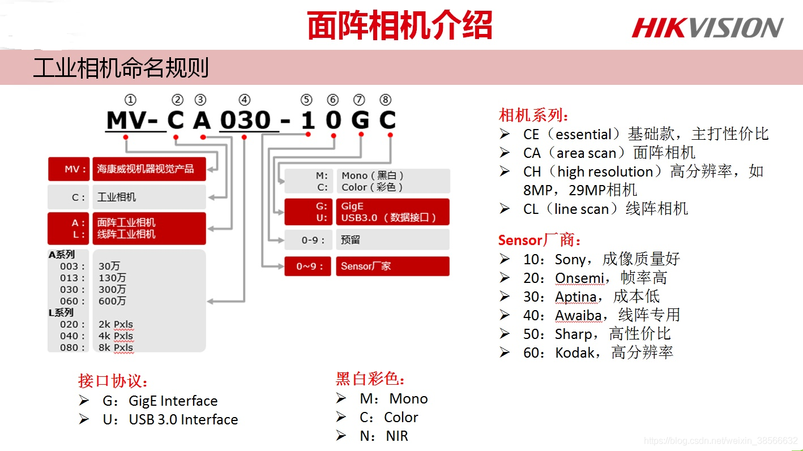

https://blog.csdn.net/weixin_38566632/article/details/118705225
海康机器人网站：https://www.hikrobotics.com/cn

## 海康威视相机系列

CE系列经济型
CE系列是主打高性价比的经济型系列产品，像素覆盖面很广。以卷帘曝光为主，也有部分全局曝光。提供千兆网和USB 3.0数据接口，可以满足多种工业需求。
CA系列进阶型
CA系列是进阶型的系列产品，主打中低分辨率，高图像品质。相机大多为全局曝光相机，分辨率布局密集，可满足细分应用需求。同样具备网口和U口两种数据接口，能够满足高帧率，稳定输出高质量图像需求。主打的Sony芯片程序质量优秀，Onsemi芯片系列像元尺寸一致，无需调整镜头成像距离即可同像素精度下，实现视野升级。
CS系列二代产品
本着精益求精的设计理念，海康机器人推出CS系列二代工业相机产品。系列产品从外观设计、产品开发到生产管控，都力求实现技术突破，给原有用户带来使用上的升级体验。同时更加入了丰富的进阶ISP功能，减轻用户图像处理的负担。
CH系列高端型
CH系列为高端型系列产品，针对FPD检测、3C、电子半导体、新能源等行业的高精尖应用开发，同时满足高分辨率、高帧率需求。产品覆盖GigE、USB 3.0、10GigE、Camera Link、CoaXPress多种数据接口，与国内外顶尖传感器厂商密切合作。同时多年的工艺积累和严苛的质量管控，也让系列产品在高端应用中具备国内一流的交付优势。

