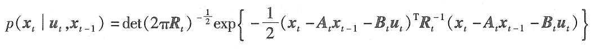
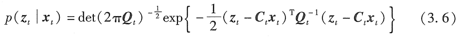
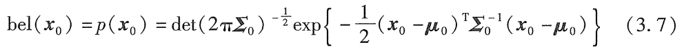
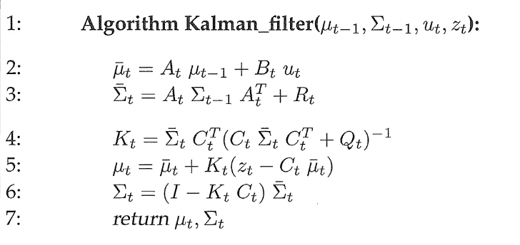

# 高斯滤波
高斯滤波是一个递归状态估计器家族，是连续空间的贝叶斯滤波中最早、最容易处理的工具。
高斯滤波的置信度哟个多元正态分布表示：
$$
p(x) = det(2\pi\Sigma)^{-\frac{1}{2}}exp(-\frac{1}{2}(x-\mu)^T\Sigma^{-1}(x-\mu))
$$
高斯函数表示后验的优点：
1. 单峰，有单一的极大值
2. 后验以小的不确定性聚集在真实状态周围
高斯滤波中的两种参数：
1. 矩参数：均值和方差，分别为一阶矩和二阶矩。正态分布的其他矩都是0
2. 正则参数：或者叫本质参数
上面两种参数功能上等效，存在从一种到另一种的双射映射。
# 卡尔曼滤波KF
卡尔曼滤波是贝叶斯滤波的一种，假设服从线性高斯分布。卡尔曼滤波实现了对连续状态的置信度计算，不适用于离散或混合状态空间。
KF用矩参数表示置信度：在时刻t，置信度用均值$\mu_t$和方差$\Sigma_t$表达。如果除了贝叶斯滤波的马尔可夫假设以外，还具有如下三个特性，则后验就是高斯的：
1. 状态转移概率$p(x_t|u_t, x_{t-1})$必须是带有随机高斯噪声的参数的线性函数，可由下式表示：
	$$x_t = A_t x_{t-1} + B_t u_t + \varepsilon_t$$
	式中，$x_t$和$x_{t-1}$为状态向量；$u_t$为时刻t的控制向量。$A_t$和$B_t$为矩阵，$A_t$为nxn方阵，n为状态向量$x_t$的维数。$B_t$为nxm的矩阵，m为控制向量$u_t$的维数。将状态和控制向量分别乘以矩阵$A_t$和$B_t$，转态转移函数与其参数呈线性关系，因此KF假设线性系统是动态的。
	$\varepsilon_t$是一个高斯随机向量，表示由状态转移引入的不确定性。其维数与状态向量维数相同，均值为0，方差用$R_t$表示。上式的状态转移概率称为线性高斯，反映了它与带有附加高斯噪声的自变量呈线性。
上式的状态转移概率表示如下：
2. 测量概率$p(z_t|x_t)$也与带有高斯噪声的自变量呈线性关系：
	$$z_t = C_t x_t + \delta_t$$
	$C_t$为kxn的矩阵，k为测量向量$z_t$的维数；向量$\delta_t$为测量噪声。$\delta_t$的分布是均值为0，方差为$Q_t$的多变量高斯分布。因此测量概率有下面的多远分布给定：
	
3. 初始置信度$bel(x_0)$必须是正态分布，用$u_0$表示均值，$\Sigma_0$表示方差：
	
## 卡尔曼滤波算法
KF表示均值为$\mu_t$、方差为$\Sigma_t$的在时刻t的置信度$bel(x_t)$。输入是t-1时刻的置信度，均值和方差为$\mu_{t-1}$ $\Sigma_{t-1}$。为了更新这些参数，KF需要控制向量$u_t$和测量向量$z_t$。输出就是t时刻的置信度$bel(x_t)$

上图中的2、3行为估计、5、6行是使用测量来对估计量进行更新。测量量参与的程度用第四行计算的$K_t$表示，$K_t$叫作卡尔曼增益，可以看做是更新的权重。
对于卡尔曼滤波的推导部分的答疑：
1. 公式（3.32）为什么说二次函数$L_t(x_t)$的二阶导数的逆，就是置信度$\overline bel(x_t)$的协方差。
	前面的推导说明$L_t(x_t)$是$s_t$的二次型，意味着$\overline bel(x_t)$服从正态分布。对高斯函数求二阶导数可以知道，二阶导数就是方差的逆。