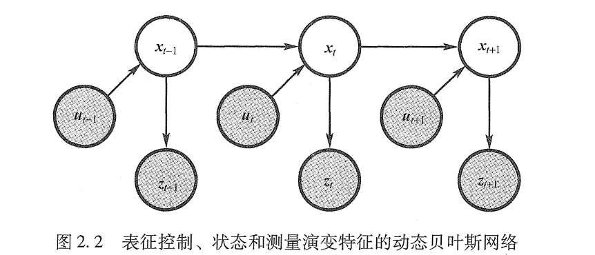
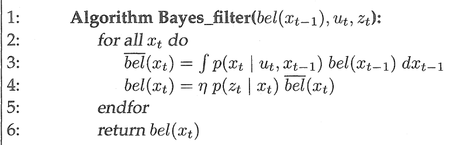
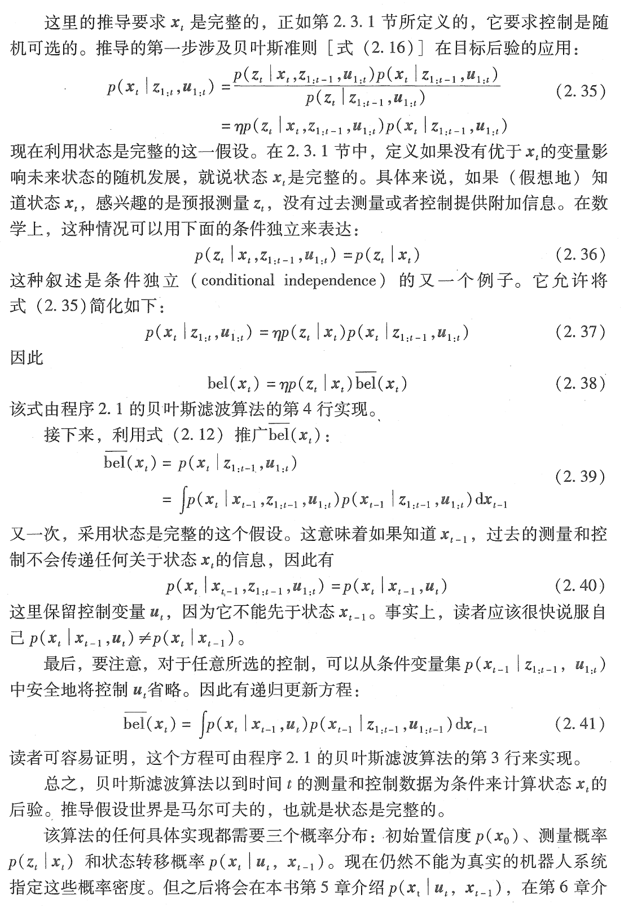

# 贝叶斯滤波
把联合概率密度公式分解为一个条件概率密度和一个非条件概率密度的乘积，得：
$$
p(x,y) = p(x|y)p(y) = p(y|x)p(x)
$$
重新整理上面的公式可以得到贝叶斯公式：
$$
p(x|y) = \frac{p(y|x)p(x)}{p(y)}
$$
如果我们有了状态的先验（prior）概率密度函数p(x)和传感器模型p(y|x)，就可以推断（infer）状态的后验（posterior）概率密度函数。为此可以将分母展开：
$$
p(x|y) = \frac{p(y|x)p(x)}{\int{p(y|x)p(x)dx}}
$$
可以通过如下边缘化（marginalization）的方式计算分母p(y)：
$$
p(y) = p(y)\int{p(x|y)dx} = \int{p(x|y)p(y)dx} \\
= \int{p(x, y)dx} = \int{p(y|x)p(x)dx} \\
注：\int{p(x|y)dx}=1
$$
在贝叶斯推断中:
**p(x)称为先验密度
p(x|y)称为后验密度
p(y|x)为传感器模型**
**先验概率**是通过以往的经验分析对状态进行估计得到的概率；
**后验概率**指在当前状态下，得到了一定的观测，或者造成了一定的效应，得到这个观测或者效应信息之后，对状态修正后的概率，即对先验状态估计值和测量值进行加权，得到理论上最接近真实值的结果。
其中：x是系统当前的状态；y是传感器的测量值；p(y|x)是系统处于x状态下，传感器测量值为y的概率密度；希望根据当前状态以及当前状态下得到的观测，来对当前的状态进行更新。
# 概率机器人中对状态、概率的描述
## 状态
环境特征以状态（state）来表征。认为状态是所有会对未来产生影响的机器人及其环境的所有方面因素。
静态状态（static state）：建筑物的位置等
动态状态（dynamic state）：随时间变化，如机器人附近人的行踪。
状态也包括机器人本身的变量，如机器人的位姿、速度、传感器是否正常等。
书中的典型状态：
1. 机器人位姿（pose)
2. 机器人操作中，机器人位姿包括有关机器人执行机构配置的变量，如转动关节的关节角度。
3. 机器人的速度和角速度，称为动态状态。
4. 环境中周伟物体的位置和特征
5. 移动的物体、人的位置和速度等也是潜在的状态变量
6. 其他影响机器人运行的状态变量，如传感器是否故障等。
### 完整性
假设一个状态$x_t$可以最好地预测未来，则称其为完整的（complete）。完整性包括过去状态测量及控制的信息，但不包含其他可以更加精确地预测未来的其他附加信息。**完整性的定义并不是要求未来是一个关于状态的确定的函数**，未来可以是随机的，但是没有先于$x_t$的状态变量可以影响未来状体的随机变化。除非这种依赖通过状态$x_t$起作用。满足这些条件的暂态过程通常称为马尔可夫链。
## 环境交互
机器人和环境存在两种基本的交互类型：
1. 机器人通过执行机构影响环境的状态：
	1. 控制动作改变世界的状态，控制动作的实例包括机器人运动和物体的操纵。为了一致性，假定机器人总是执行一个控制动作，这个动作包括“什么都不做”
2. 通过传感器收集有关状态的信息
	1. 感知是一个过程，通过这个过程，机器人利用传感器获得环境状态的信息，例如采集图像、测距扫描或者查询其触觉传感器来接收有关环境状态的信息。这种感知交互的结果叫作测量（measurement）、或者观察（observation）或者认知（percept）

通过上面的两种交互类型，可以获得两张类型的数据：
1. 控制数据携带环境中关于状态改变的信息，如机器人的速度、里程计的测量（虽然里程计是传感器，但是仍将起视为控制数据，因为他们测量了控制动作的影响）。控制数据用$u_t$表示，总是与时间间隔$(t-1; t]$内状态的变化有关。
2. 环境测量数据提供了环境的暂态信息，如采集的图像。在时间t的测量数据表示为$z_t$。
## 概率生成法则
状态和测量的演变由概率法则支配，通常状态$x_t$随机的由状态$x_{t-1}$产产生。乍一看，状态$x_t$的出现可能是以过去所有的状态、测量和控制为条件的。因此状态演变的概率法则可由以下形式的概率分布给出：$p(x_t|x{0:t-1}, z_{1:t-1}, u_{1:t})$。一般假设机器人首先执行一个控制动作$u_1$，然后得到一个测量$z_1$
**重要的见解**如果状态x是完整的，那么它是以前时刻发生的所有状态的充分总结，具体说，$x_{t-1}$是直到t-1时刻的控制和测量的一个充分统计量，即$u_{1:t-1}$和$z_{q:t-1}$。上面提到的所有变量，只有控制$u_t$关心是否知道状态$x_{t-1}$。由此可以简化如下对状态的建模：**状态转移概率**
$$
p(x_t|x_{0:t-1}, z_{1:t-1}, u_{1:t}) = p(x_t | x_{t-1}, u_t)
$$
对测量的建模:**测量概率**
$$
p(z_t | x_{0:t}, z_{1:t-1}, u_{1:t}) = p(z_t | x_t)
$$
即，用状态$x_t$足以预测（有潜在噪声的）测量$z_t$。
状态转移概率和测量概率一起描述机器人机器环境组成的动态随机系统。如下图动态贝叶斯网络描述的状态和测量的演变。时刻t的状态随机地依赖t-1时刻的状态和控制$u_t$。测量$z_t$随机地依赖时刻t的状态。这样的时间生成模型称为**隐马尔可夫模型HMM**或者**动态贝叶斯网络DBN**

## 置信分布
置信度反映了机器人有关环境状态的内部信息，前面所述的状态不能直接测量，必须从数据中推测其位姿。需要从位姿的内部置信度识别出真正的状态。概率机器人通过条件概率分布表示置信度。对于真实状态，置信度分布为每一个可能的假设分配一个概率。置信度分布是以可获得数据为条件的关于状态变量的后验概率。用$bel(x_t)$表示状态变量$x_t$的置信度：
$$
bel(x_t) = p(x_t | z_{1:t}, u_{1:t})
$$
这个后验是时刻t下状态$x_t$的概率分布，以所有过去测量$z_{1:t}$和所有过去控制$u_{1:t}$为条件。
默认置信度是在综合了测量$z_t$后得到的。有时，可以证明在刚刚执行完控制$u_t$之后，综合$z_t$之前计算后验是有用的。这样的后验可以表示为：
$$
\overline{bel}(x_t) = p(x_t | z_{1:t-1}, u_{1:t})
$$
在概率滤波的框架下，该概率被称为**预测**，该术语反映了一个事实：$\overline{bel}(x_t)$是基于以前状态的后验，在综合时刻t的测量之前，预测了时刻t的状态。由$\overline{bel}(x_t)$计算$bel(x_t)$称为修正（correction）或者测量更新（measurement update）。
## 贝叶斯滤波算法
时刻t的置信度$bel(x_t)$由时刻t-1的置信度$bel(x_{t-1})$来计算。
输入是时刻t-1的置信度、最近的控制作用$u_t$和最近一次的测量$z_t$。输出是时刻t的置信度$bel(x_t)$。下面给出贝叶斯滤波算法的一次迭代：更新规则，由前面计算的置信度$bel(x_{t-1})$计算下一个置信度$bel(x_t)$：
上图描述了贝叶斯滤波的两个步骤：第三行的控制更新（或预测）和第四行的测量更新。
第三行处理控制$u_t$。通过基于状态$x_{t-1}$的置信度和控制$u_t$来计算状态$x_t$的置信度。具体说，机器人分配给状态$x_t$的置信度$\overline{bel}(x_t)$通过两个分布的积分（求和）得到，这两个分布指$x_{t-1}$的置信度和由控制$u_t$引起的从$x_{t-1}$到$x_t$的转移概率。
第四行，贝叶斯滤波算法用已经观测到的测量$z_t$的概率诚意置信度$\overline{bel}(x_t)$。对没一个假想的后验状态$x_t$都这样做。在真实推到中，乘积结果通常不再是一个概率，总和可能不为1。因此结果需要通过归一化常数$\eta$进行归一化，从而导出最后的置信度$bel(x_t)$
### 贝叶斯滤波的数学推导
贝叶斯滤波算法的正确性由归纳法说明，为了这样做，必须说明它正确地由上一步的对应后验$p(x_{t-1}|z_{1:t-1}, u_{1:t-1})$计算了后验分布$p(x_t|z_{1:t}, u_{1:t})$。再将时刻t=0的置信度$bel(x_0)$正确初始化的假设下，正确性可由推导得出：

