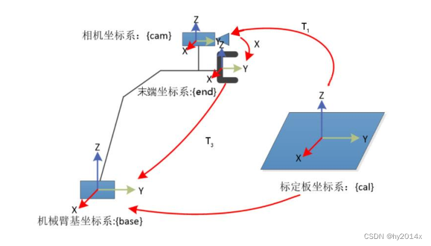
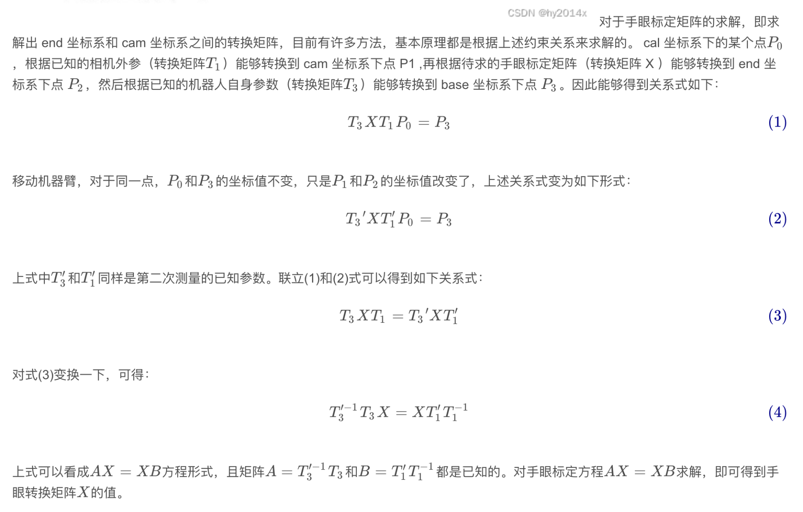
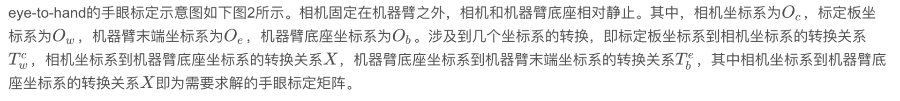
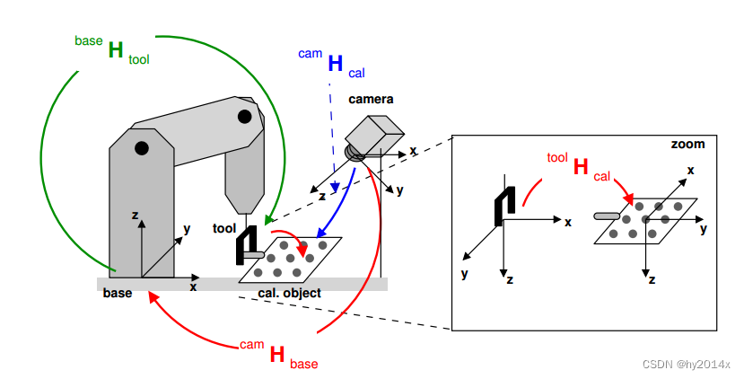
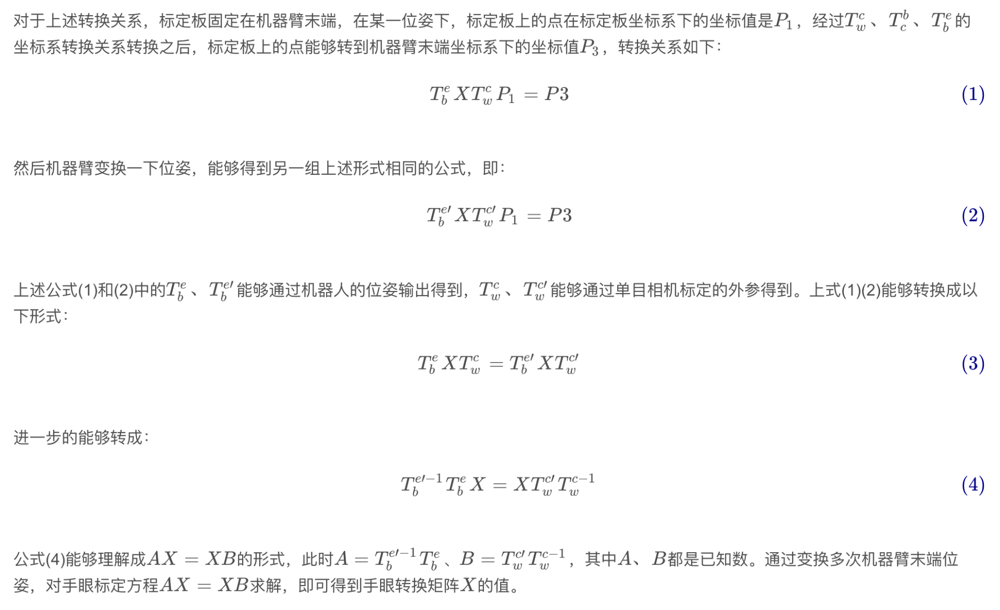

# 概述
手眼标定是指求解出工业机器人的末端坐标系与相机坐标系之间的坐标变换关系，或者工业机器人的基底坐标系与相机坐标系之间的坐标变换关系。手眼标定有两种情形：第一种是相机（眼）固定在机器臂（手）的末端，相机相对于机器臂末端是固定的，相机跟随机器臂移动，这种方式的手眼标定成为 Eye-in-hand；第二种是相机（眼）和机器臂（手）分离，相机相对于工业机器人的基座是固定的，机器臂的运动对相机没有影响, 这种方式的手眼标定成为 Eye-to-hand。    
# 1. 眼在手上
对于 Eye-in-hand 手眼标定方式，需要求解工业机器人的末端坐标系与相机坐标系之间的坐标转换关系。 Eye-in-hand 手眼标定的原理示意图如图 1所示。这其中有几个坐标系， 基础坐标系（用 base 表示） 是机器臂的基底坐标系，末端坐标系（用 end 表示） 是机器臂的末端坐标系， 相机坐标系（用 cam 表示） 是固定在机器臂上面的相机自身坐标系，标定物坐标系（用 cal 表示）是标定板所在的坐标系。任意移动两次机器臂，由于标定板和机器臂的基底是不动的，因此对于某个世界点，其在 base 坐标系和 cal 坐标系下的坐标值不变，在 end 坐标系和 cam 坐标系下的坐标值随着机器臂的运动而改变。根据这一关系，可以求解出end坐标系和 cam 坐标系之间的转换矩阵。具体求解过程如下。     
    
    

# 2. 眼在手外

    
    
     
