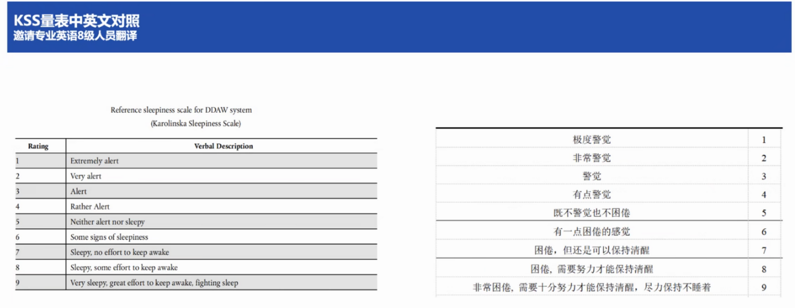

# 5月30日工作

1.  两幅图landmark的三角化，投影到其他图片查看匹配程度。其中MC-Calib中标定出的相机的位姿关系是坐标系到坐标系的变换，从0号相机坐标系变换到其他相机坐标系，即 $T_{wc}$ 。根据这个关系，三角化的过程正确。两幅图三角化的三维点投影到其他图像，位置大致正确，需要进一步优化。
2.  尝试用python版的g2o进行优化，目前g2o的接口还没有完全理解。
3.  考虑模型输出置信度的方法。
    1.  视线的置信度方法：把模型输出的yaw/pitch两个角度恢复成向量，gt的yaw/pitch也恢复成向量，计算两个向量的夹角，把这个夹角在【0，180】之间换算成【0，1】之间的小数，把这个值当做置信度
    2.  关键点置信度方法：主要针对眼睛和嘴巴。这两个区域分别用关键点包围的多边形和gt包围的多边形之间计算IoU，把IoU当做置信度。

# 5月31日工作

## 上午
1.  DDAW中的KSS（Karolinska Sleepiness Scale）线上培训，说明一下每个睡意等级的含义，以及KSS的评价方法。通过眼电或者脑电测量设备输出信号，并于测试驾驶员自己汇报的睡意等级做一个匹配，判断驾驶员所说的不同等级是否有区别。如果没有什么区别，说明这个测试驾驶员无法区分不同睡意等级。最后筛选能够区分睡意等级的驾驶员参与DDAW的测试。
    
	
2. 与数据采集公司金山云沟通
## 下午
1. 完成多相机下，landmark的重建和联合优化
2. 给紫安讲解landmark重建流程