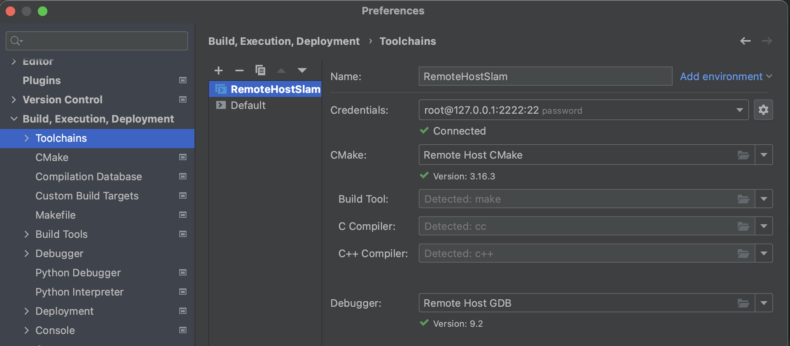
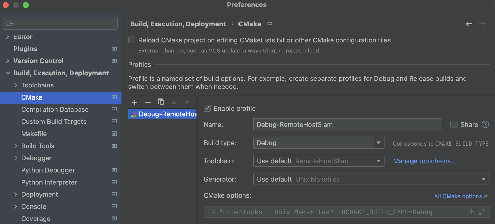
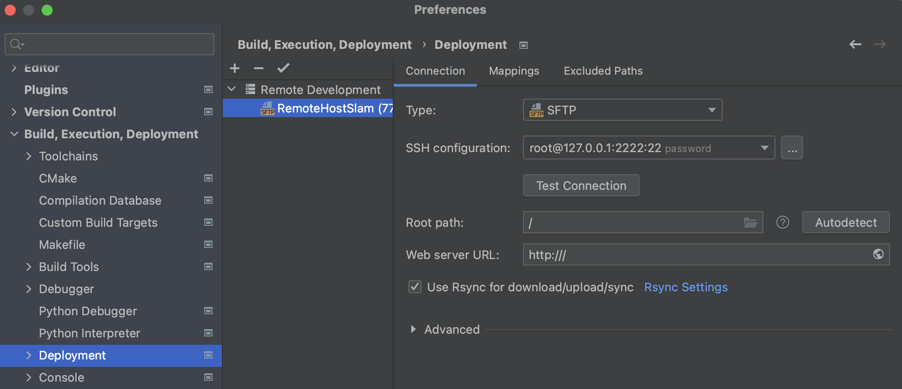
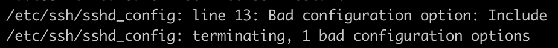

# docker配置

1.  docker安装，按照docker官网的步骤安装即可，docker已经适配m1芯片
    
2.  docker中安装ubuntu18.04镜像，可以直接拉取官方镜像，然后自己安装各种应用。此时为了安装加速，可以配置国内镜像源，参考更换源的方法。
    
3.  启动容器
    
    ```
    docker run -it --name slam -v $localDir:$containerDir -p $localPort:$containerPort imagename /bin/bash
    ```
    
    其中-p \$localPort:\$containerPort 是将容器端口映射到宿主机的指定端口
    
4.  应用安装：
    
    ```
    apt install build-essential cmake make gdb ssh openssh-server vim rsync pkg-config
    ```
    
5.  修改root密码
    
    ```
    passwd //输入两次密码
    ```
    
6.  配置ssh服务
    
    ```
    vim /etc/ssh/sshd_config
    UsePAM no
    UsePrivilegeSeparation no
    PermitRootLogin yes
    PasswordAuthentication yes
    ```
    
7.  启动ssh服务并设为开机启动
    
    ```
      /etc/init.d/ssh start(or restart)
    systemctl start sshd
    systemctl enable sshd
    ```
    
8.  把上面基本环境配置好的container进行commit，得到新的镜像
    
    ```
    docker commit [containerID] [imageName]:[tag]
    ```
    
9.  根据上面新的镜像启动新的容器，安装第三方库等
    

# clion远程配置

配置clion，目的是希望在docker的ubuntu环境中开发，主要原因：一是m1芯片在C++开发中可能存在一些适配问题；二是在docker中开发，不会污染mac的环境。
虽然用到了docker，并不意味着在clion的Toolchains中要选择docker。如果选择了docker，由于clion启动容器的命令中默认使用了“-rm”参数，好像每次关闭clion会把容器删除。好像不太方便。具体的docker怎么使用，不太清楚。

* * *

1.  在clion的Toolchains中选择Remote Host
    
    
    上图是完全配置好的样子
    
2.  配置Credentials：Host 和 Port是我们想要连接到的电脑，在这里就是docker中的ubuntu系统。其中Host(docker容器)为127.0.0.1，Port(宿主机)为2222, Local port(docker容器)为22，密码是docker容器的密码。
    
3.  cmake的配置
    
    
    点击+，Toolchains选择上面的配置。
    
4.  配置Deployment
    
    
    这里主要是把宿主机上的代码同步到docker的一个临时目录中，然后在这个临时目录中进行编译。
    

经过上面的步骤，clion连接docker就配置完成了。

# 配置过程中遇到的问题

1.  docker容器中，ubuntu容器中，软件源修改为国内镜像，需要注意区分x86_64/amd64和arm64.
2.  配置docker时，拉取原始ubuntu，启动容器进行基础配置，容器启动时，用的端口影射为 -p 22:22。配置完成并且commit新的镜像后，又启动了新的容器，用的端口映射为 -p 2222:22。
    然后在配置clion Remote Host过程中，由于不清楚Host 后面的Port具体指docker容器的port还是宿主机的port，以为是docker容器的port，所以填的22，local port填的2222，这样竟然连上了第一次启动的docker容器，这就导致三方库在cmake中一直找不到。
3.  ssh服务的配置，需要根据上面的步骤6配置/etc/ssh/sshd_config，并重启ssh服务，这样clion的Remote Host才能连上docker。

4. 遇到下列连接问题：
	 ```
		Can't connect to remote host: net.schmizz.sshj.transport.TransportException: Server closed connection during identification exchange.
	```
	一般是docker容器进行了某些修改，比如卸载了openssh-server等，再重新安装之后，需要重启ssh：执行步骤7。直接执行/etc/init.d/ssh start显示ssh服务开启，但是仍然报下面的错误，此时/etc/init.d/ssh restart出错，提示
	 
	 按照提示把/etc/ssh/sshd_config文件中的Include行删掉，就可以正常连接了。
	

---
参考链接：
https://zhuanlan.zhihu.com/p/458293882
https://zhuanlan.zhihu.com/p/429270402

```
docker run -it --name slamdisplay -e DISPLAY=:0 -v /Users/hanfuyong/workspace/slam:/home/aal/workspace -v /Users/hanfuyong/workspace/3rdparty:/home/aal/3rdparty -p 3333:33 9f471337d2bb /bin/bash
```