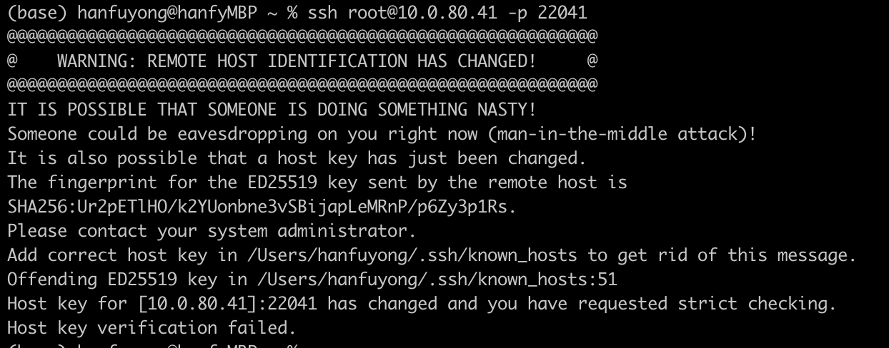

# 1\. Docker + vscode 登录

1.  docker容器中安装openssh-server
2.  docker容器中修改/etc/ssh/sshd_config，添加 PermitRootLogin yes
3.  ssh服务重启：service ssh restart
4.  vscode配置remote-explorer：

```
Host docker
  HostName 10.0.76.43
  User root
  Port 22041

Host *
  HostName %h
  AddKeysToAgent yes
  UseKeychain yes
  IdentityFile ~/.ssh/id_rsa
  ServerAliveInterval 60
  ServerAliveCountMax 300000
```

5.  如果提示连接失败，密钥不对。通过客户端ssh连接到docker容器时，会提示下列错误：  
    

可以看到，客户端的.ssh/known_hosts中的第51行密钥不正确，那么只需要在docker容器中获取公钥进行替换即可：  
则在docker容器中执行下列命令可以获得公钥：

```
cat /etc/ssh/ssh_host_*_key.pub
```

# 2\. ubuntu中docker不用sudo

1.  首先检查是否已经创建了docker组：一般docker安装时会自动创建
    
    ```
    getent group docker
    ```
    
    如果没有，则手动创建
    
    ```
    sudo groupadd docker
    ```
    
2.  **将用户添加到 Docker 组**：这里的 $USER 是一个环境变量，表示当前用户。如果您要添加其他用户，可以直接替换 $USER 为用户名
    
    ```
    sudo usermod -aG docker $USER
    ```
    
3.  重新登录  
    为了使更改生效，您需要重新登录。您可以注销当前会话，然后重新登录，或者简单地重启计算机。
4.  命令行中不需要加sudo，但是tmux中需要用sudo，如何解决这个问题
     ```
	 重新加载用户的组信息:
	 newgrp docker
	 ```

# docker 镜像保存和加载

1.  把已有的docker镜像保存为tar文件
    
    ```
    docker save -o my_image.tar my_image:my_tag
    ```
    
2.  导入镜像
    
    ```
    docker load -i my_image.tar
    ```