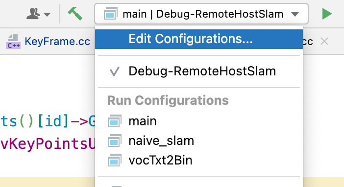
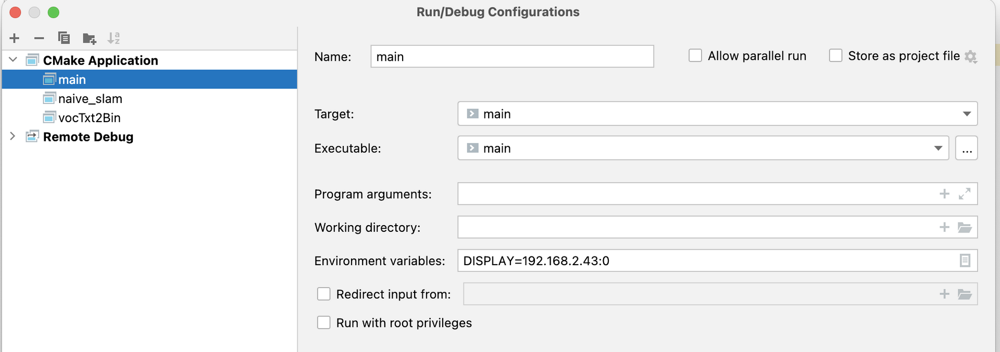

1.  安装XQuartz
    
2.  配置XQuartz：偏好设置-》安全性-》允许从网络客户端连接
    
3.  mac终端执行：
    
    ```
    xhost+
    ```
    
4.  运行容器
    
    ```
    docker exec -it -e DISPLAY=[mac的ip]:0 [容器名] /bin/bash
    ```
    
5.  安装socat：从XQuartz 2.7.9开始，不再监听tcp 6000端口了，只能把unix socket转换为tcp socket才能正常运行x11应用 https://github.com/moby/moby/issues/8710#issuecomment-72669844
    
    ```
    brew install socat
    socat TCP-LISTEN:6001,reuseaddr,fork UNIX-CLIENT:\"$DISPLAY\"
    ```
    
6.  启动XQuartz，在docker容器中运行程序，可以显示opencv图形；
    
7.  通过Clion运行并显示图形，需要对可执行程序的Environment variables配置DISPLAY，如下图
    
    
    

# 使用中遇到的问题

1.  使用一段时间后，突然没办法显示图像了。尝试过重启xQuartz、export DISPLAY=192.168.2.43:0、重新执行“ socat TCP-LISTEN:6001,reuseaddr,fork UNIX-CLIENT:"$DISPLAY" “，都不好使。
    **解决方法**：在mac终端中执行” xhost + “。