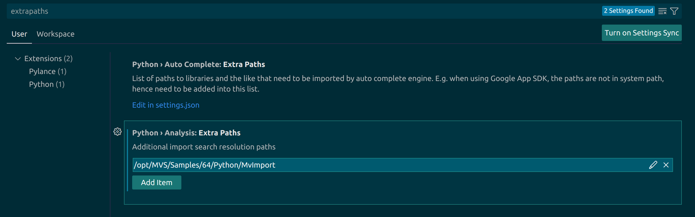

## 问题：

```
sys.path.append("/opt/MVS/Samples/64/Python/MvImport")
from MvCameraControl_class import *
```

上面代码添加了路径“/opt/MVS/Samples/64/Python/MvImport”，但是这个路径下的模块MvCameraControl_class无法被代码提示工具（如pylance、pylint等）识别。

## 解决方法：

把上面要添加的路径加入到settings.json的python.analysis.extraPaths中
