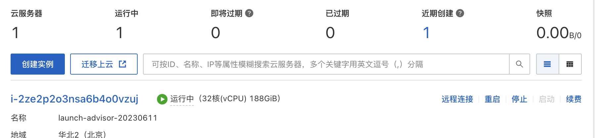
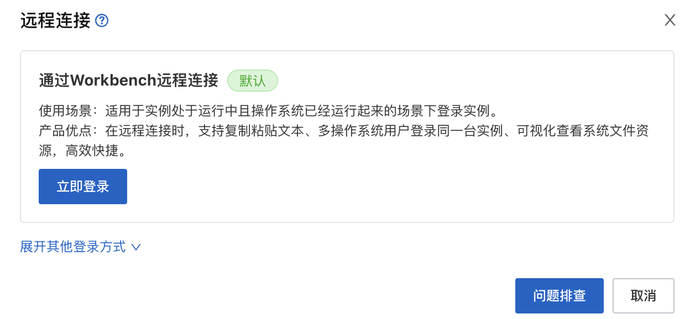
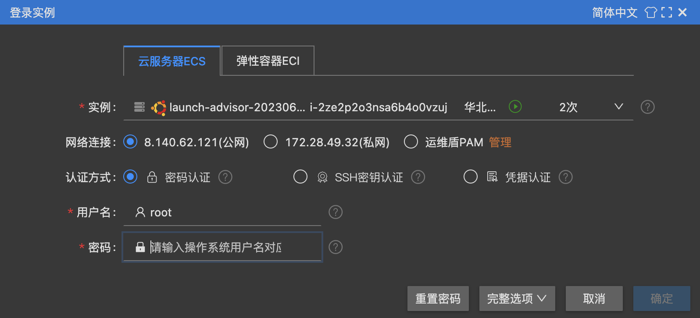
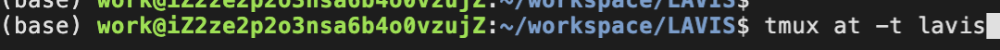

# 账号

| 用途  | 账号  | 密码  |
| --- | --- | --- |
| 登录阿里云 | aliyun3758396748 | zk123w123 |
|     | root | Lee_1234 |
|     | work | 1234 |
|     | VNC | Lee123 |

# 使用方法

1.  登录阿里云服务器：https://ecs.console.aliyun.com/home?spm=5176.8789780.J_4267641240.3.659845b5ooae5b
    
2.  点击”远程连接“-> "立即登录" -\> 输入root用户的密码Lee_1234 -> 切换到work用户：su work -> 进入/home/work/workspace/LAVIS -> 进入tmux会话：tmux at -t lavis
    
    
3.  "立即登录"
    
    
4.  输入root用户的密码Lee_1234
    
    
5.  切换到work用户：su work
    
6.  进入/home/work/workspace/LAVIS
    
7.  进入tmux会话：tmux at -t lavis
    
    
8.  开始pretrain的训练
    

* * *

1.  分布式训练已经改成单卡训练
2.  目前只下载了coco数据集，其他数据集在lavis/projects/blip/train/pretrain_14m.yaml中已经注释掉。