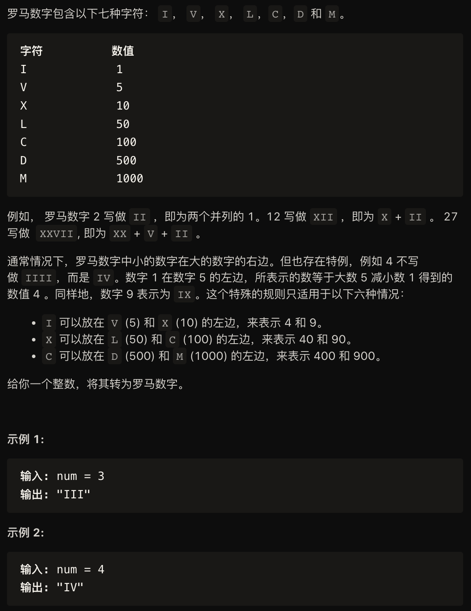
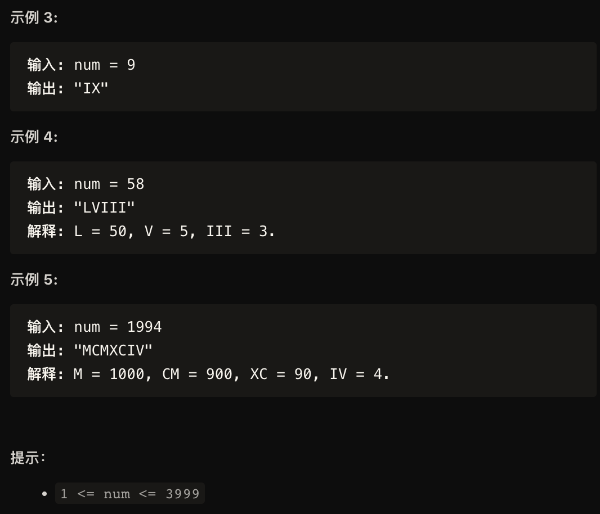

解法一：
```
#include <iostream>
#include <vector>
#include <math.h>

const std::pair<int, std::string> valueSymbols[] = {
    {1000, "M"},
    {900, "CM"},
    {500, "D"},
    {400, "CD"},
    {100, "C"},
    {90, "XC"},
    {50, "L"},
    {40, "XL"},
    {10, "X"},
    {9, "IX"},
    {5, "V"},
    {4, "IV"},
    {1, "I"}
};

class Solution{
public:
    std::string solve(int num){
        std::string roman;
        for (const auto& vs: valueSymbols){
            while(num >= vs.first){
                roman += vs.second;
                num -= vs.first;
            }
            if (0 == num){
                break;
            }
        }
        return roman;
    }
};
```