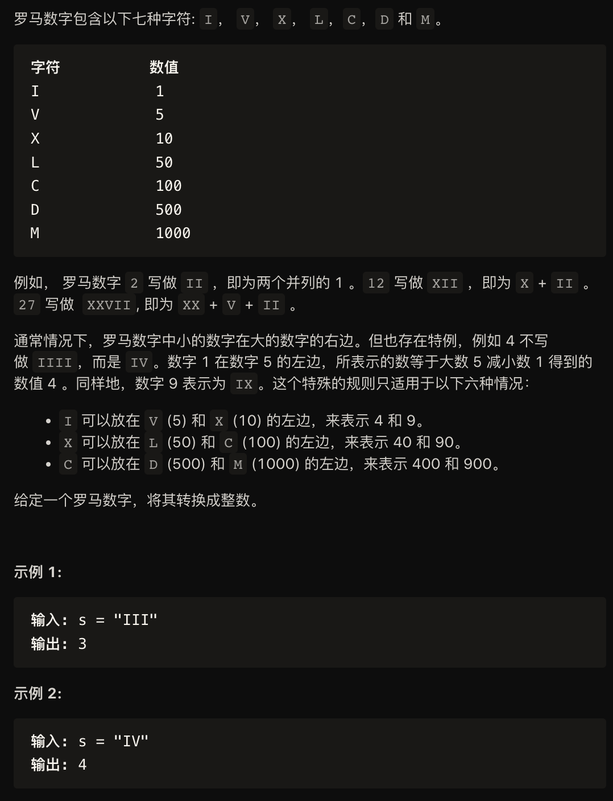
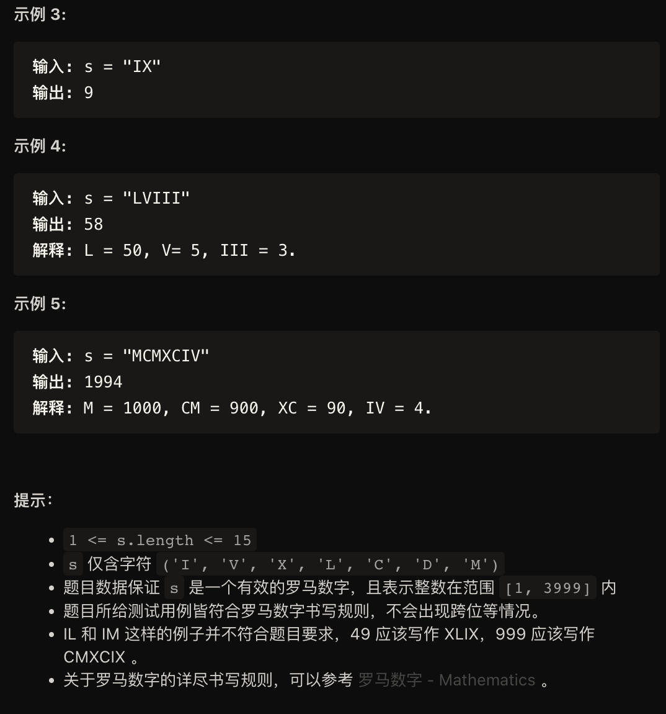

解法一：
```
#include <iostream>
#include <vector>
#include <math.h>
#include <unordered_map>


class Solution{
public:
    std::unordered_map<char, int> symbolValues = {
        {'I', 1},
        {'V', 5},
        {'X', 10},
        {'L', 50},
        {'C', 100},
        {'D', 500},
        {'M', 1000}
    };
    int romanToInt(std::string s){
        int ans = 0;
        int n = s.size();
        for (int i = 0; i < n; ++i){
            int value = symbolValues[s[i]];
            if (i < n - 1 && value < symbolValues[s[i + 1]]){
                ans -= value;
            }
            else{
                ans += value;
            }
        }
        return ans;
    }
};
```