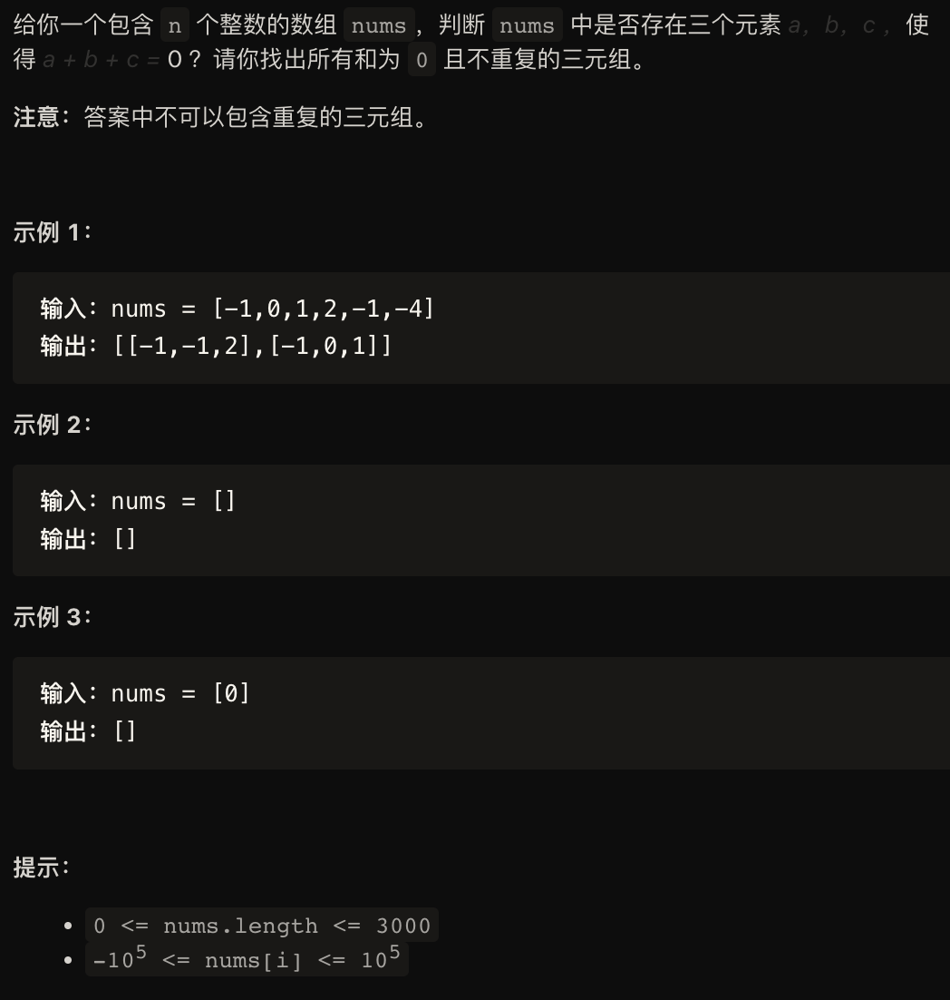

解法一：
```
class Solution{
public:
    vector<vector<int>> solve(vector<int>& nums){
        int n = nums.size();
        sort(nums.begin(), nums.end());
        vector<vector<int>> ans;
        for (int i = 0; i < n; ++i){
            if(i > 0 && nums[i] == nums[i - 1]){
                continue;
            }
            int r = n - 1;
            for (int l = i + 1; l < n; ++l){
                if (l > i + 1 && nums[l] == nums[l - 1]){
                    continue;
                }
                while(l < r && nums[i] + nums[l] + nums[r] > 0){
                    --r;
                }
                if(l == r){
                    break;
                }
                if (nums[i] + nums[l] + nums[r] == 0)
                    ans.push_back({nums[i], nums[l], nums[r]});
            }
        }
        return ans;
    }
};
```