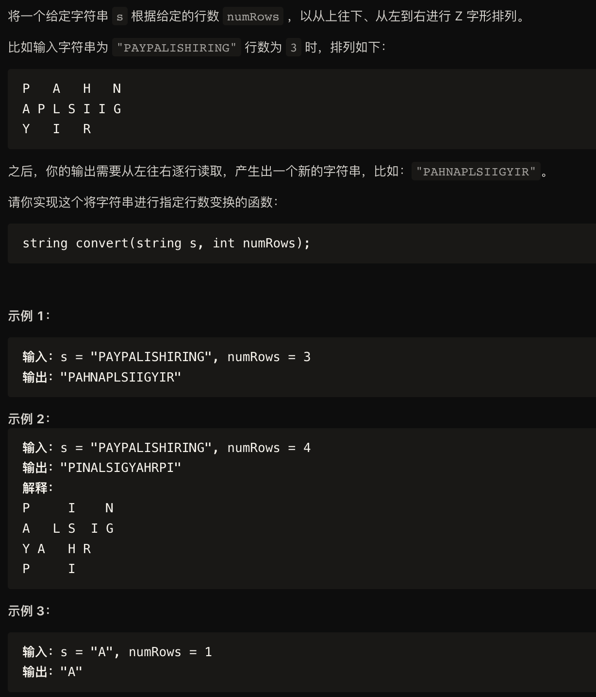

解法一：直接构造
```
class Solution{
public:
    std::string solve(std::string s, int numRows){
        int n = s.length(), r = numRows;
        if (r >= n || r == 1){
            return s;
        }
        int t = 2 * r - 2; // 周期
        int c = (n + t - 1 ) / t * (r - 1); // 需要的列数
        std::vector<std::vector<char>> M(r, std::vector<char>(c, '0'));
        for (int i = 0, x = 0, y = 0; i < n; ++i){
            M[x][y] = s[i];
            if (i % t < r - 1){
                ++x;
            }
            else{
                --x;
                ++y;
            }
        }
        std::string rst;
        for (int x = 0; x < r; ++x){
            for (int y = 0; y < c; ++y){
                if (M[x][y] != '0'){
                    rst += M[x][y];
                }
            }
        }
        return rst;
    }
};
```

解法二：空间压缩
```
class Solution{
public:
    std::string solve(std::string s, int numRows){
        int n = s.length(), r = numRows;
        if (r >= n || r == 1){
            return s;
        }
        int t = 2 * r - 2; //周期
        std::vector<std::string> M(r);
        for (int i = 0, x = 0; i < n; ++i){
            M[x] += s[i];
            if(i % t < r - 1){
                ++x;
            }
            else{
                --x;
            }
        }

        std::string rst;
        for (auto &row : M){
            rst += row;
        }
        return rst;
    }
};
```