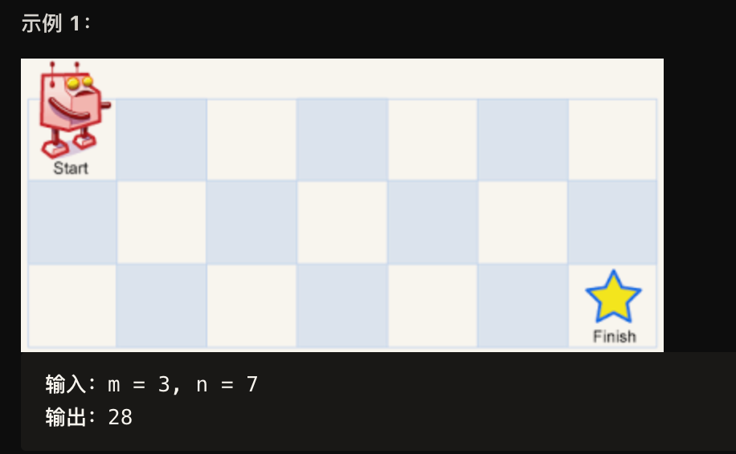

一个机器人位于一个 m x n 网格的左上角 （起始点在下图中标记为 “Start” ）。

机器人每次只能向下或者向右移动一步。机器人试图达到网格的右下角（在下图中标记为 “Finish” ）。

问总共有多少条不同的路径？


解法：
动态规划法：
```
#include <iostream>
#include <vector>

class Solution{
public:
    int solve(int m, int n){
        std::vector<std::vector<int>> dp(m, std::vector<int>(n));
        for (int i = 0; i < m; i++){
            dp[i][0] = 1;
        }
        for (int j = 0; j < n; j++)
            dp[0][j] = 1;
        for (int i = 1; i < m; ++i){
            for (int j = 1; j < n; ++j){
                dp[i][j] = dp[i - 1][j] + dp[i][j - 1];
            }
        }
        return dp[m -1][n-1];
    }
};

int main(int argc, char** argv){
    Solution solution = Solution();
    int steps = solution.solve(3, 7);
    std::cout << steps << std::endl;
}
```