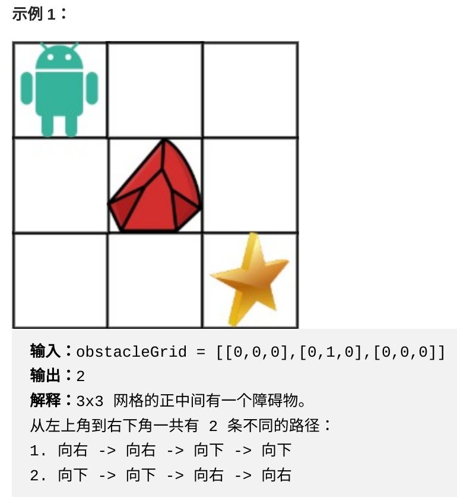

一个机器人位于一个 m x n 网格的左上角 （起始点在下图中标记为 “Start” ）。

机器人每次只能向下或者向右移动一步。机器人试图达到网格的右下角（在下图中标记为 “Finish”）。

现在考虑网格中有障碍物。那么从左上角到右下角将会有多少条不同的路径？

网格中的障碍物和空位置分别用 1 和 0 来表示。


解法一：
```
class Solution {
public:
    int uniquePathsWithObstacles(vector<vector<int>>& obstacleGrid) {
        int m = obstacleGrid.size();
        int n = obstacleGrid[0].size();
        vector<vector<int>> dp(m, vector<int>(n));
        for (int i = 0; i < m && obstacleGrid[i][0] ==0; ++i){
            dp[i][0] = 1;
        }
        for (int j = 0; j < n && obstacleGrid[0][j] == 0; ++j){
            dp[0][j] = 1;
        }
        for (int i = 1; i < m; ++i){
            for (int j = 1; j < n; ++j){
                if (obstacleGrid[i][j] == 0){
                    dp[i][j] = dp[i-1][j] + dp[i][j-1];
                }
            }
        }
        return dp[m-1][n-1];
    }
};
```

解法二：空间优化
```
class Solution {
public:
    int uniquePathsWithObstacles(vector<vector<int>>& obstacleGrid) {
        int m = obstacleGrid.size();
        int n = obstacleGrid[0].size();
        vector<int> dp(n);
        dp[0] = (obstacleGrid[0][0] == 0);
        for (int i = 0; i < m; ++i){
            for (int j = 0; j < n; ++j){
                if(obstacleGrid[i][j] == 1){
                    dp[j] = 0;
                    continue;
                }
                if(j - 1 >=0 && obstacleGrid[i][j] == 0){
                    dp[j] = dp[j] + dp[j - 1];
                }
            }
        }
        return dp[n-1];
    }
};
```