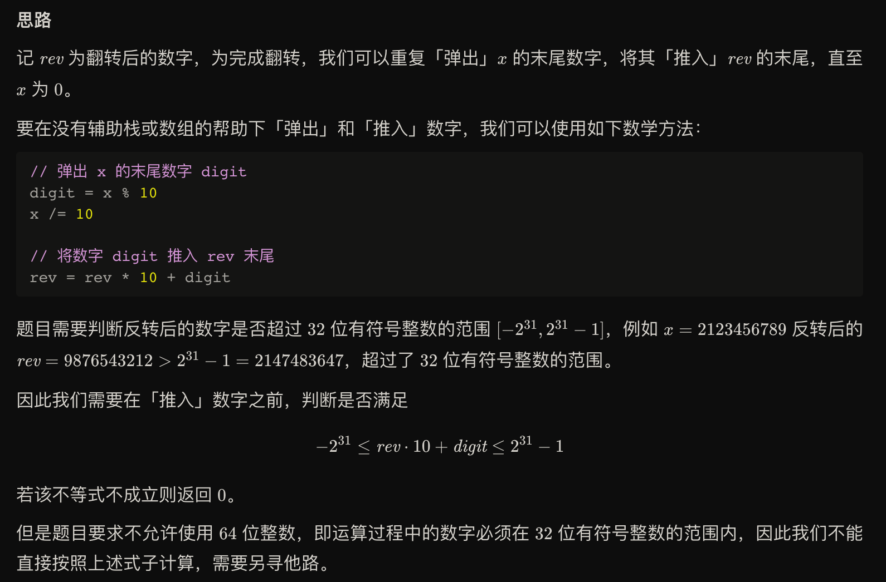
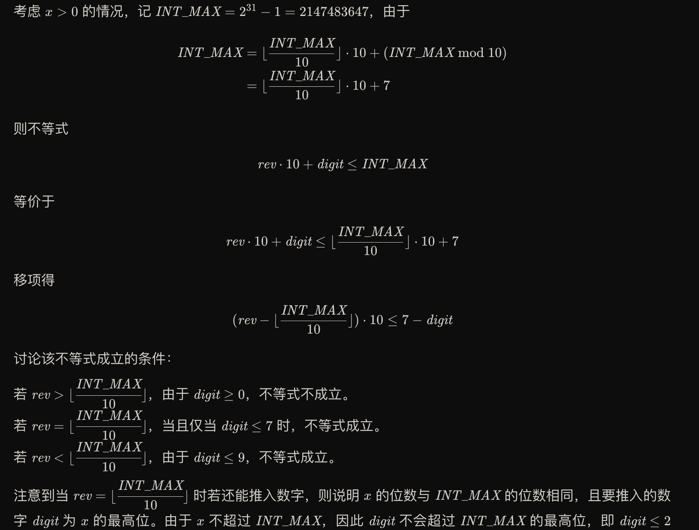
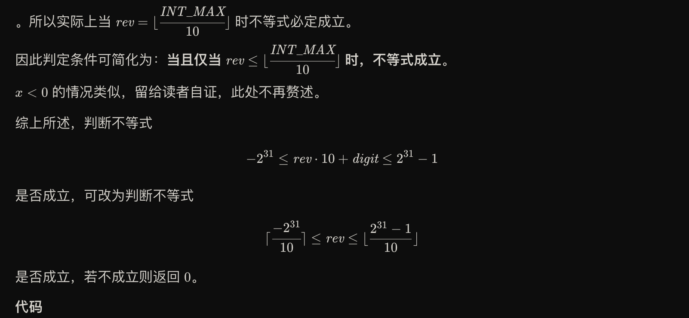

给你一个 32 位的有符号整数 x ，返回将 x 中的数字部分反转后的结果。

如果反转后整数超过 32 位的有符号整数的范围 [−231,  231 − 1] ，就返回 0。

假设环境不允许存储 64 位整数（有符号或无符号）。
 

示例 1：

输入：x = 123
输出：321
示例 2：

输入：x = -123
输出：-321
示例 3：

输入：x = 120
输出：21
示例 4：

输入：x = 0
输出：0
 

提示：

-231 <= x <= 231 - 1





解法一：
```
class Solution {
public:
    int reverse(int x) {
        int rev = 0;
        while(x != 0){
            if (rev < INT_MIN / 10 || rev > INT_MAX / 10){
                return 0;
            }
            int dig = x % 10;
            rev = rev * 10 + dig;
            x = x / 10;
        }
        return rev;
    }
};
```

