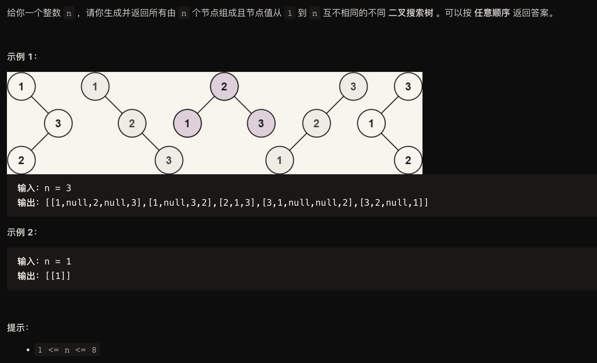

Binary Search Tree（BST）、二叉搜索树、二叉查找树、二叉排序树
性质：是一颗空树、或者：若它的左子树不空，则左子树上所有结点的值均小于它的根结点的值； 若它的右子树不空，则右子树上所有结点的值均大于它的根结点的值； 它的左、右子树也分别为二叉排序树。

解法一：递归法：
```
#include <iostream>
#include <vector>
#include <math.h>

struct TreeNode{
    int val;
    TreeNode *left;
    TreeNode *right;
    TreeNode(): val(0), left(nullptr), right(nullptr){}
    TreeNode(int x): val(x), left(nullptr), right(nullptr){}
    TreeNode(int x, TreeNode* left, TreeNode* right): val(x), left(left), right(right){}
};


class Solution{
public:
    std::vector<TreeNode*> generateTrees(int start, int end){
        if (end < start)
            return {nullptr};
        std::vector<TreeNode*> allTrees;

        for (int i = start; i <= end; ++i){
            // 循环用start作为根节点
            // i == 1：表示1作为根节点，左子树为nullptr，右子树为[2, end]的所有可能
            // i == 2：表示2作为根节点，左子树为[1]的所有可能，右子树为[3, end]的所有可能
            // i == 3：表示3作为根节点，左子树为[1,2]的所有可能，右子树为[4, end]的所有可能 ...
            // 最后把每种情况的左子树和右子树两两组合。最后把所有情况的所有组合返回。
            std::vector<TreeNode*> leftTrees = generateTrees(start, i - 1);
            std::vector<TreeNode*> rightTrees = generateTrees(i + 1, end);
            for(auto &left: leftTrees){
                for (auto &right: rightTrees){
                    TreeNode *tree = new TreeNode(i);
                    tree->left = left;
                    tree->right = right;
                    allTrees.emplace_back(tree);
                }
            }
        }
        return allTrees;
    }

    std::vector<TreeNode*> generateTrees(int n){
        if(!n){
            return {};
        }
        return generateTrees(1, n);
    }
};
```