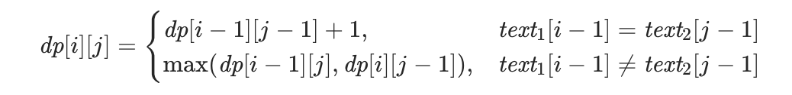
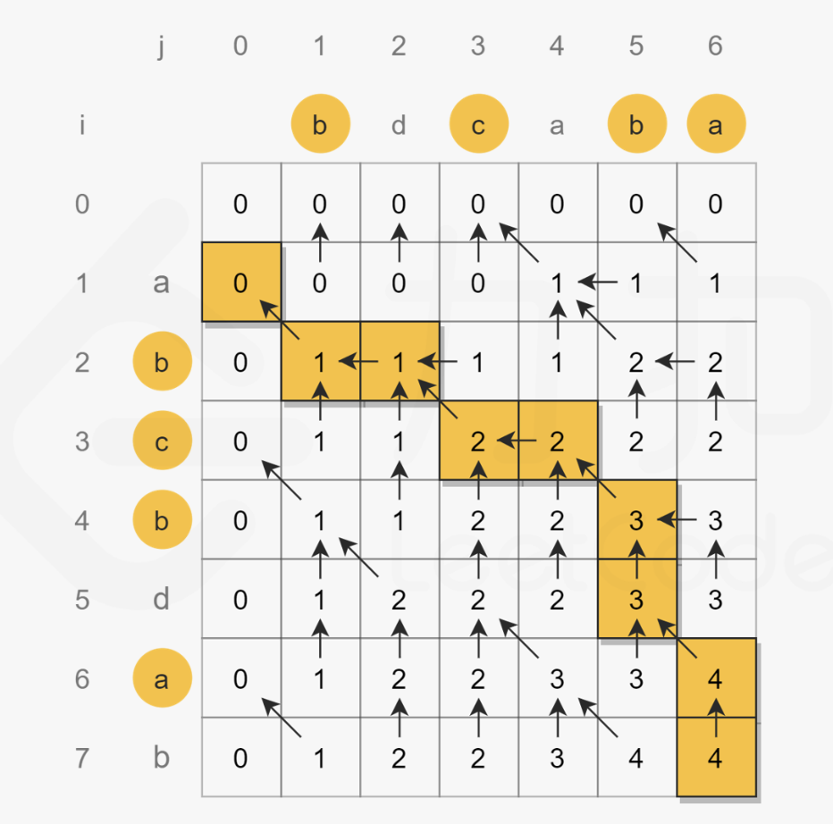

# 字符串之间的转换关系
## 解题方法：
<font color=red>用动态规划算法，先解决两个字符串的前缀子串之间的转换关系，一步步的推导出两个完整字符串的转换关系，所以这里的子问题就是前缀子串的转换。</font>
## 优化方法
<font color=blue>优化方法</font>一般是针对空间复杂度进行优化，把二维数组转换成一维。
对于一个状态转移方程，如果第 i 行的状态只和第 i-1 行相关，那么就可以通过滚动数组的方式，把二维状态数组转换成两个一维的数组，一个表示当前行，另一个表示上一行。

## 示例
### 1\. 【剑指 Offer II 095. 最长公共子序列】https://leetcode.cn/problems/qJnOS7/

两个字符串的公共子序列的动态规划，分别比较两个字符串不同长度的前缀，即字符串1的长度为i的前缀和字符串长度为【0， len2】的前缀分别比较。
状态方程：

如下图：


#### 解法一：
dp\[i]\[j]表示 第一个字符串的【0，i】子串和第二个字符串的【0，j】子串，这两个子串的最大公共前缀长度。
```C++
class Solution {
public:
    int longestCommonSubsequence(string text1, string text2) {
        int len1 = text1.size();
        int len2 = text2.size();
        vector<vector<int>> dp(len1 + 1, vector<int>(len2 + 1, 0));
        for(int i = 1; i <= len1; i++){
            char c1 = text1[i - 1];
            for(int j = 1; j <= len2; j++){
                char c2 = text2[j - 1];
                if(c1 == c2){
                    dp[i][j] = dp[i - 1][j - 1] + 1;
                }
                else{
                    dp[i][j] = max(dp[i - 1][j], dp[i][j - 1]);
                }
            }
        }
        return dp.back().back();
    }
};
```

### 2. 【115. 不同的子序列】https://leetcode.cn/problems/distinct-subsequences/
**题解**：https://leetcode.cn/problems/distinct-subsequences/solution/dong-tai-gui-hua-dpmo-ban-jie-jue-yi-zho-if29/
同样按照前缀进行匹配。即 t\[0: i] 和 s\[0: j] 比较
分为两种情况：
一、s\[j] != t\[i]，那么dp\[i]\[j] = dp\[i]\[j-1]
二、s\[j] == t\[i]，又分两种情况：【用】第 j 个字符和【不用】第 j 个字符：dp\[i]\[j] = dp\[i-1]\[j-1] + dp\[i]\[j-1]。
<font color=red>当字符相同时，分为【用】【不用】或者【选】【不选】等两种情况，可以简化思考</font>
#### 解法一：
~~~C++
class Solution {
public:
    int numDistinct(string s, string t) {
        int slen = s.size();
        int tlen = t.size();
        vector<vector<long long>> dp(tlen + 1, vector<long long>(slen+1));
        for(int j = 0; j <= slen; j++){
            dp[0][j] = 1;
        }

        for(int i = 1; i <= tlen; i++){
            char ci = t[i-1];
            for(int j = 1; j <= slen; j++){
                char cj = s[j - 1];
                if(ci != cj){
                    dp[i][j] = dp[i][j-1];
                }
                else{
                    dp[i][j] = dp[i][j-1] + dp[i-1][j-1];
                }
            }
        }
        return dp.back().back();
    }
};
~~~

#### 解法二：滚动数组优化
因为之和前一个和上一个相关，所以只需要两个向量就可以表示。
~~~C++
class Solution {
public:
    int numDistinct(string s, string t) {
        int slen = s.size();
        int tlen = t.size();
        vector<long long> dp(slen+1, 1);

        for(int i = 1; i <= tlen; i++){
            vector<long long> dp2(slen+1);
            char ci = t[i-1];
            for(int j = 1; j <= slen; j++){
                char cj = s[j - 1];
                if(ci != cj){
                    dp2[j] = dp2[j-1];
                }
                else{
                    dp2[j] = dp2[j-1] + dp[j-1];
                }
            }
            dp = dp2;
        }
        return dp.back();
    }
};
~~~

### 3. 【72. 编辑距离】https://leetcode.cn/problems/edit-distance/
同样也是按照前缀进行转换。
~~~C++
class Solution {
public:
    int minDistance(string word1, string word2) {
        int n1 = word1.size();
        int n2 = word2.size();
        vector<vector<int>> dp(n1+1, vector<int>(n2+1, 0));
        for(int i = 0; i < n1+1; i++){
            dp[i][0] = i;
        }
        for(int j = 0; j < n2 + 1; j++){
            dp[0][j] = j;
        }
        for(int i = 1; i < n1 + 1; i++){
            for(int j = 1; j < n2 + 1; j++){
                if(word1[i-1] == word2[j-1])
                    dp[i][j] = dp[i-1][j-1];
                else
                    dp[i][j] = min(min(dp[i-1][j-1], dp[i][j-1]), dp[i-1][j]) + 1;
            }
        }
        return dp[n1][n2];
    }
};
~~~

### 4. 【583. 两个字符串的删除操作】https://leetcode.cn/problems/delete-operation-for-two-strings/
本题同样是通过比较前缀子串之间的转换操作，一步一步的推导出两个完整字符串之间的转换操作。
~~~C++
class Solution {
public:
    int minDistance(string word1, string word2) {
        int len1 = word1.size();
        int len2 = word2.size();
        vector<vector<int>> dp(len1 + 1, vector<int>(len2 + 1));
        for(int i = 0; i < len1 + 1; i++){
            dp[i][0] = i;
        }
        for(int j = 0; j < len2 + 1; j++){
            dp[0][j] = j;
        }

        for(int i = 1; i < len1 + 1; i++){
            char c1 = word1[i-1];
            for(int j = 1; j < len2 + 1; j++){
                char c2 = word2[j-1];
                if(c1 == c2){
                    dp[i][j] = dp[i-1][j-1];
                }
                else{
                    dp[i][j] = min(dp[i-1][j], dp[i][j-1]) + 1;
                }
            }
        }
        return dp.back().back();
    }
};
~~~

### 5. 【10. 正则表达式匹配】https://leetcode.cn/problems/regular-expression-matching/