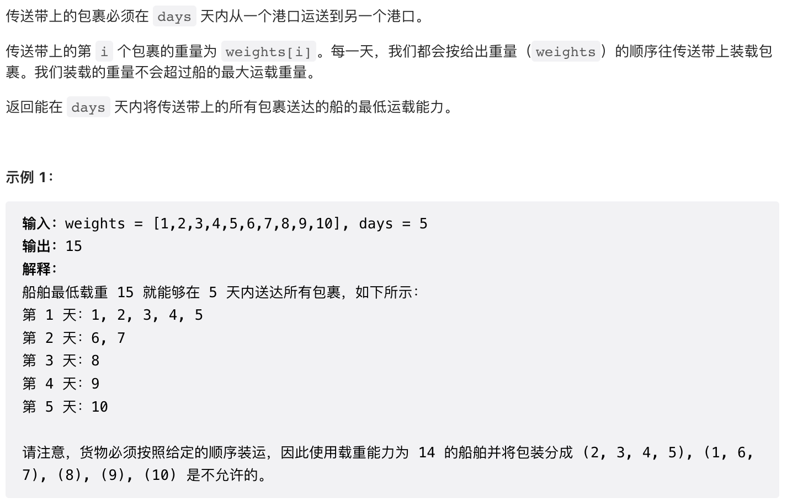
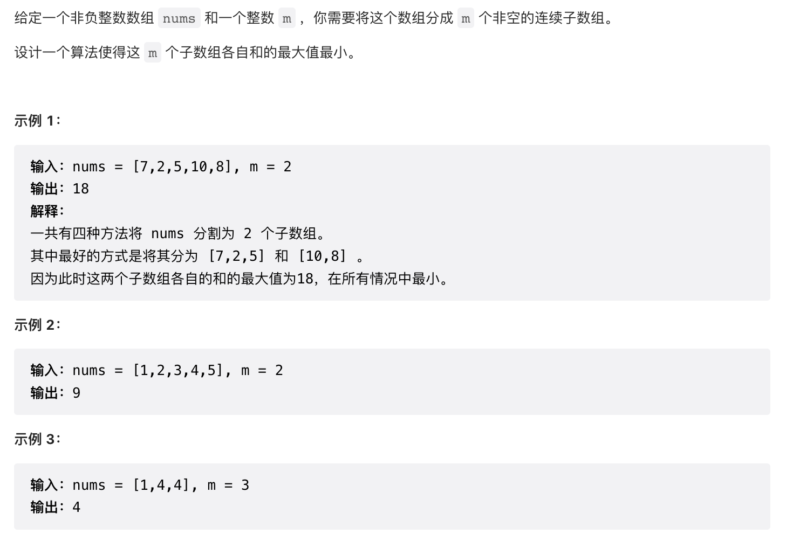
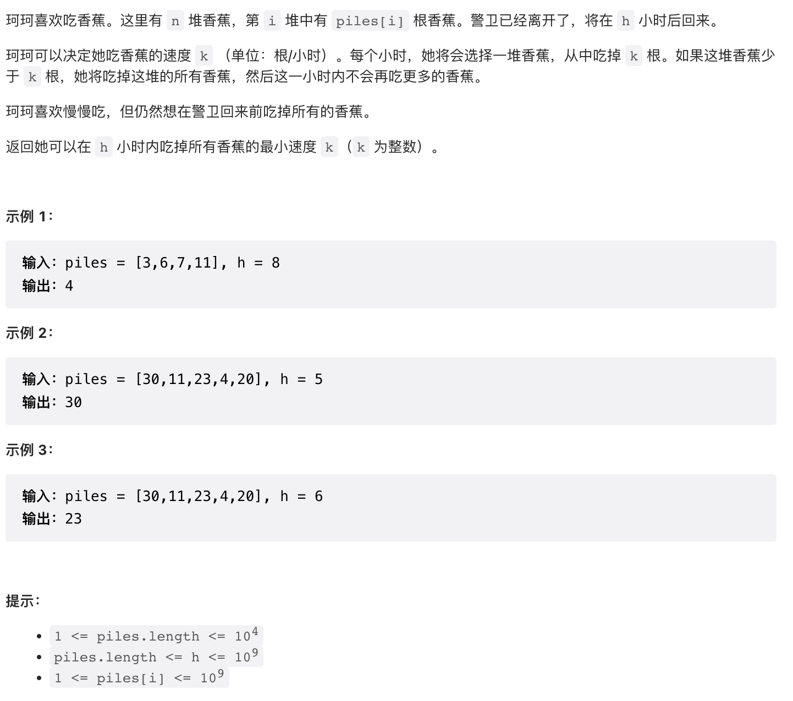
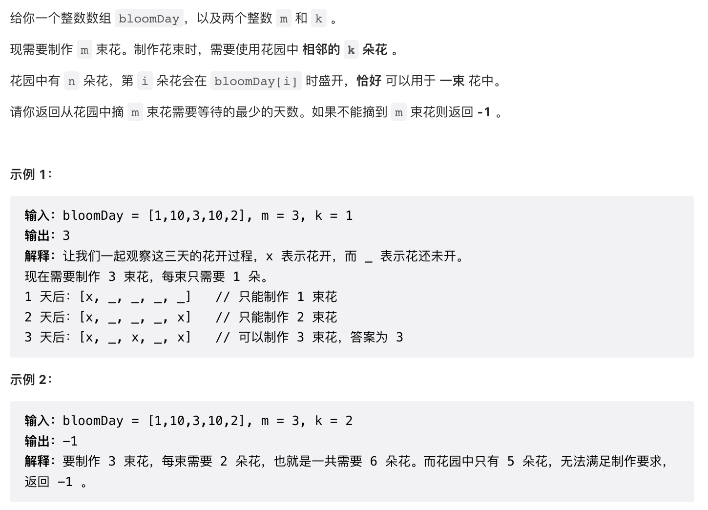
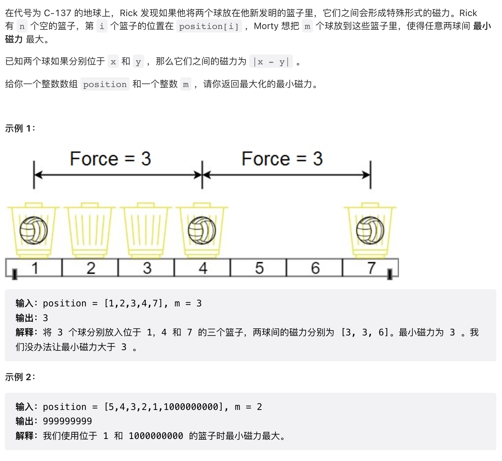

# 1\. 二分法求左右边界

示例：给定一个非递减的排序数组和一个target，求出target在数组中的左右边界，如果不存在则返回\[-1, -1\]

二分法的关键是各种细节问题：
1\. 在开区间遍历还是在闭区间遍历
2\. 循环的条件：是否包含”=“
3\. 返回的最后结果是否需要 -1。
上面三个问题的解是一致的。
**如果在左闭右开区间 \[left, right) , 则循环条件不包含”=“，最后返回右边界需要-1**

## 1.1 左闭右开区间【left, right）

（为了好记，左边界和有边界都用left返回）

### 1.1.1 左边界 （跳出循环条件为left==right,）

```
int leftBound(vector<int>& nums, int target){
    int left = 0;  // 左闭
    int right = nums.size(); // 右开
    while(left < right){
        // 因为左闭右开[left, right)，所以取不到最右边的元素，所以没有 ”=“
        int mid = left + (right - left) / 2; // (left + right)/2的写法容易整数越界
        if(nums[mid] == target){
            right = mid; // 收缩右边界
        }
        else if(nums[mid] > target){
            right = mid;
        }
        else if(nums[mid] < target){
            left = mid + 1;
        }
    }
    if(left == nums.size()) return -1; // target比nums中所有元素都大
    return nums[left]==target? left : -1;
}
```

### 1.1.2 右边界

```
int rightBound(vector<int>& nums, int target){
    int left = 0;
    int right = nums.size();
    while(left < right){
        int mid = left + (right - left) / 2;
        if(nums[mid] == target){
            left = mid + 1; // 寻找右边界，所以需要收缩左边界
        }
        else if(nums[mid] > target){
            right = mid;
        }
        else if(nums[mid] < target){
            left = mid + 1;
        }
    }
    if(left-1 < 0) return -1;
    return nums[left-1] == target? left -1: -1;
}
```

## 1.2 左闭右闭区间【left, right】

### 1.2.1 左边界

```
int leftBound(vector<int>& nums, int target){
    int left = 0;
    int right = nums.size() - 1;
    while(left <= right){
        int mid = left + (right - left)/2;
        if(nums[mid] == target){
            right = mid - 1;
        }
        else if(nums[mid] > target){
            right = mid - 1;
        }
        else if(nums[mid] < target){
            left = mid + 1;
        }
    }
    if(left == nums.size()) return -1;
    return nums[left] == target? left : -1;
}
```

### 1.2.2 右边界

```
int rightBound(vector<int>& nums, int target){
    int left = 0;
    int right = nums.size() -1;
    while(left <= right){
        int mid = left + (right - left) / 2;
        if(nums[mid] == target){
            left = mid + 1;
        }
        else if(nums[mid] > target){
            right = mid - 1;
        }
        else if(nums[mid] < target){
            left = mid + 1;
        }
    }
    if(left - 1 < 0) return -1;
    return nums[left - 1] == target ? left-1: -1;
}
```

## 2\. 示例
下面的题目解决方法：
1. 构建一个新的待遍历数组，这个数组是递增的，在这个数组上找到左边界/右边界
2. 对于这个数组中的每个元素，求出在这个元素值下的最小代价或者最大价值（value)
3. 把这个value和目标比较，判断左右边界的移动方法。

思想就是如何对题目进行转换，转换成二分查找

### 2.1 1011题：在 D 天内送达包裹的能力



本题需要从题干中分析出二分法：
如果不限天数，则把货物运完的最小运载为weights中的最大值，即只要保证每天运一个包裹就行
如果一天运完，则运载能力为weights中所有货物之和。
这两个值就作为二分法的左右边界【max(weights), sum(weights)】，符合题目的最小运载量就在这个区间，二分法就是对这个区间的二分。
再次审题：题目的要求1：在days天内运完，即【1，days】，则要求运载能力足够大。
题目要求2：在days天内运完的基础上，要求运载能力最低。这就说明只有恰好在days天运完，才有可能保证运载能力最低。
综上，题目是说恰好在days天内运完时，所需的最小运输能力
不考虑运输时间，则船的最低载重可取的范围为：【10，11，12，13，14，15，16，17，18，19，20，21，22，23，24，25，26，27，28，29，30，31，32，33，34，35，36，37，38，39，40，41，42，43，44，45，46，47，48，49，50，51，52，53，54，55。。。】
当恰好1天运完时，则船的最低载重范围为【55，55】
当恰好2天运完时，则船的最低载重范围【28，29，30，...，55】

```
    int ship(vector<int>& weights, int shipW){ 
    // 判断运载量为shipW时，最少需要运输的天数。因为货物的顺序不能打乱，
    // 所以相邻货物之和刚好不大于shipW，这样得到的分组可以使得运输天数最少
		// 运载量固定，判断最少运输天数，下面按货物顺序遍历能够得到正确结果的原因在于（货物的顺序不能打乱）
        int needDays = 1;
        int dayShip = 0;
        for(int i = 0; i < weights.size(); i++){
            dayShip += weights[i];
            if(dayShip > shipW){
							// 如果加上当前货物时，超过了运载量，
							// 那么运载时间应该加一天，并且新的一天货物总重量的初始值
							// 为当前货物重量。
                needDays++;
                dayShip = weights[i];
            }
        }
                return needDays;
    }

    int shipWithinDays(vector<int>& weights, int days) {
        int left = weights[0], right = 0;
        for(int i = 0; i < weights.size(); i++){
            right += weights[i];
            left = max(left, weights[i]);
        }
        // 求左边界
        while(left <= right){
            int mid = left + (right - left) / 2;
            if(ship(weights, mid) <= days){
                right = mid - 1;
            }
            else{
                left = mid + 1;
            }
        }
        return left;
    }
```

### 2.2 410题：分割数组的最大值



本题和上面的题本质上是一模一样的。
划分成m个组，假设有n种划分方法，把各个划分方法中子数组元素和的最大值按照从小到大排列，选择最小的那个。
把分组的数看成天数，子数组元素之和看作船的运载量，元素和的最大值即船的运载量必须是货物重量的最大值。这样已转换，与上面的题目本质是一样的。

```
int split(vector<int>& nums, int largerSum){
        int partNum = 1;
        int partSum = 0; // 用于判断是否分到一组
        for(int i = 0; i < nums.size(); i++){
            partSum += nums[i];
            if(partSum > largerSum){
                partNum++;
                partSum = nums[i];
            }
        }
        return partNum;
    }

    int splitArray(vector<int>& nums, int k) {
        int left = nums[0], right = 0;
        for(int i = 0; i < nums.size(); i++){
            left = max(left, nums[i]);
            right += nums[i];
        }
        while(left <= right){
            int mid = left + (right - left) / 2;
            if(split(nums, mid) <= k)
                right = mid - 1;
            else
                left = mid + 1;
        }
        return left;
    }
```

### 2.3 875题：爱吃香蕉的珂珂



本题与上面原理是一样的，**在时间n内完成某件事所用的最小速度**
**转换思路**：在时间n内，最多可以吃的香蕉数量

```
    long eatingTime(vector<int>& piles, int eatingSpeed){
        long eatingHour = 0; // 用long是因为测试用例
        for(int i = 0; i < piles.size(); i++){
            eatingHour += ceil(piles[i] * 1.0 / eatingSpeed);
        }
        return eatingHour;
    }

    int minEatingSpeed(vector<int>& piles, int h) {
        int left = 1, right = piles[0];
        for(int i = 0; i < piles.size(); i++){
            right = max(right, piles[i]);
        }
        while(left <= right){
            int mid = left + (right - left) / 2;
            if(eatingTime(piles, mid) <= h){
                right = mid - 1;
            }
            else
                left = mid + 1;
        }
        return left;
    }
```

### 2.4 1482：制作 m 束花所需的最少天数



**转换思路**：等待waitDays天，最多可以制作几束花

```
    // 等待waitDay天，可以制作bunch束花
    int bunch(vector<int>& bloomDay, int k, int waitDay){
        int bunch = 0;
        int flower= 0;
        for(int i = 0; i < bloomDay.size(); i++){
            if(bloomDay[i] <= waitDay){
                flower++;
                if(flower == k){
                    bunch++;
                    flower = 0;
                }
            }
            else
                flower = 0;
        }
        return bunch;
    }

    int minDays(vector<int>& bloomDay, int m, int k) {
        if(m > bloomDay.size() / k)
            return -1;
        int left = bloomDay[0], right = bloomDay[0];
        for(int i = 0; i < bloomDay.size(); i++){
            left = min(left, bloomDay[i]);
            right = max(right, bloomDay[i]);
        }
        while(left <= right){
            int mid = left + (right - left) / 2;
            if(bunch(bloomDay, k, mid) >= m)
                right = mid - 1;
            else 
                left = mid + 1;
        }
        return left;
    }
```

### 2.5 1552题：两球之间的磁力


**转换思路**：最小间隔为minDist时，最多可以放入几个球。
把position按从小到大排列，计算最小间隔和最大间隔，二分的区间为【最小间隔，最大间隔】

```
    int putBall(vector<int>& position, int minDist){
        int ballNum = 1;
        int preid = 0;
        for(int i = 1; i < position.size(); i++){
            if(position[i] - position[preid] >= minDist){
                ballNum++;
                preid = i;
            }
        }
        return ballNum;
    }

    int maxDistance(vector<int>& position, int m) {
        sort(position.begin(), position.end());
        int left = 1, right = position.back() - position[0];
        while(left <= right){
            int mid = left + (right - left) / 2;
            if(putBall(position, mid) >= m) // 求右边界
                left = mid + 1;
            else
                right = mid - 1;
        }
        return left-1;
    }
```