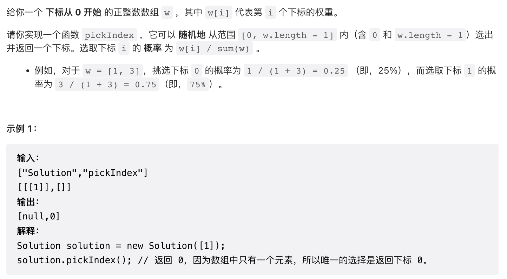

# 528题：按权重随机选择



题意：一个整数数组w，w\[i\]代表第 i 个元素的权重。实现一个函数：随机返回一个元素下标，要求这个被选中的元素的概率为其权重。
比如 w = 【1， 2， 3， 4】
要求
输出 1的概率为 1/10
输出 2的概率为 2/10
输出 3的概率为 3/10
输出 4的概率为 4/10.
现在只有一个按均匀分布产生随机数的随机数生成器 rand()，用均匀分布的随机数生成器实现一种符合权重的随机数生成器。
**为什么前缀和能解决这个问题**：\[1, 2, 3, 4]，通过该函数计算的结果为 \[1, 3, 6, 10]。前缀和划分出了几个区间：\[0, 1), \[1, 3), \[3, 6), \[6, 10)，每个区间的长度为1、2、3、4，区间总长度为10。让均匀分布的随机数生成器rand()随机产生一个数，对10取模后会落到 \[0, 10) 上，落到每个自区间的概率为自区间长度除以区间总长。

```
class Solution {
public:
    std::vector<int> preSum;
    Solution(vector<int>& w) {
        std::partial_sum(w.begin(), w.end(), std::back_inserter(preSum));
    }
    
    int pickIndex() {
        int sum = rand()%preSum.back();
        return upper_bound(preSum.begin(), preSum.end(), sum) - preSum.begin();
    }
};

/**
 * Your Solution object will be instantiated and called as such:
 * Solution* obj = new Solution(w);
 * int param_1 = obj->pickIndex();
 */
```

<font color=RED>partial_sum</font>：对范围 \[ first,last ) 内的元素逐个求累加和，放在result容器中。比如 \[1, 2, 3, 4]，通过该函数计算的结果为 \[1, 3, 6, 10]。而另一篇中，自己求得的前缀和为 \[0, 1, 3, 6, 10]。

<font color=RED>upper_bound</font>：用于在指定范围内 \[ first, last ) 查找大于目标值的第一个元素。该函数会返回一个正向迭代器，当查找成功时，迭代器指向找到的元素；反之，如果查找失败，迭代器的指向和 last 迭代器相同。
~~~C++
//查找[first, last)区域中第一个大于 val 的元素。
ForwardIterator upper_bound (ForwardIterator first, ForwardIterator last, const T& val);
//查找[first, last)区域中第一个不符合 comp 规则的元素
ForwardIterator upper_bound (ForwardIterator first, ForwardIterator last, const T& val, Compare comp);
~~~