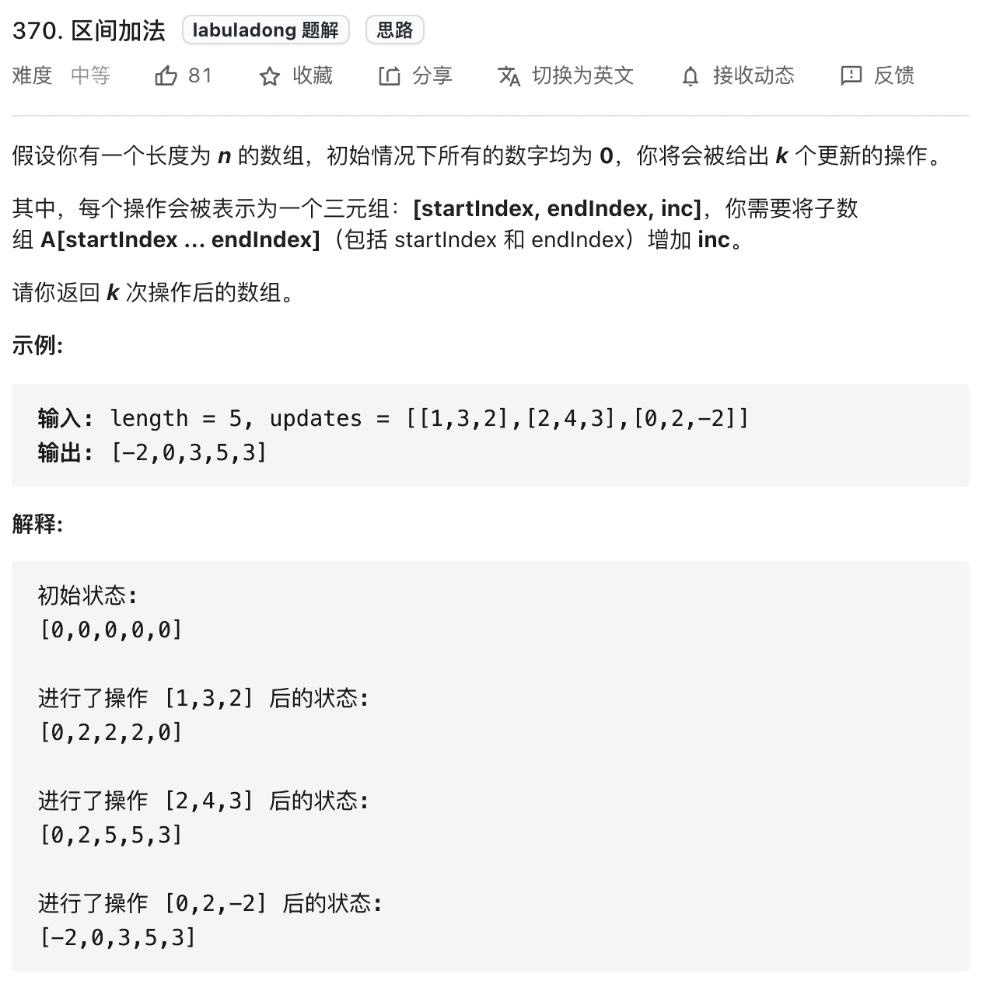
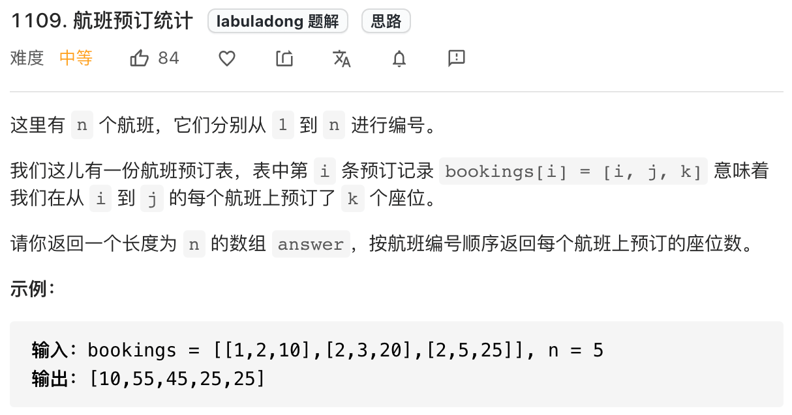
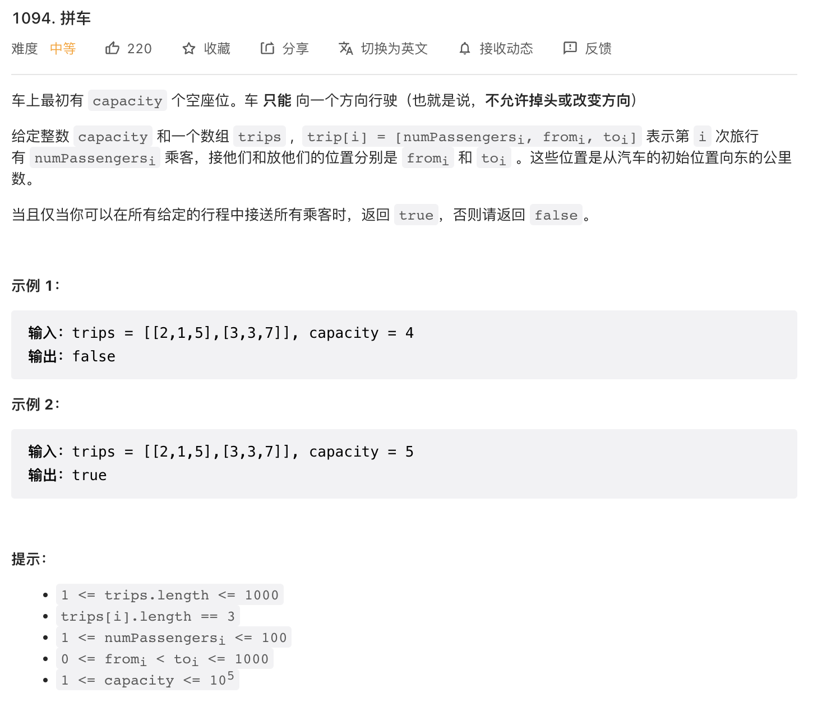

## 差分数组的适用场景是频繁的对原始数组的某个区间的元素进行增减操作

比如，输入一个数组 nums，然后又要求给区间 nums\[2..6\] 全部加 1，再给 nums\[3..9\] 全部减 3，再给 nums\[0..4\] 全部加 2，再给…，然后问，最后得到的数组的值是什么。
解决这类问题的技巧就是使用差分数组：先对原始根据原始数组构造一个diff差分数组，diff\[0\] = nums\[0\], diff\[i\] = nums\[i\] - nums\[i-1\]

根据nums数组构造差分数组：

```
std::vector<int> diff(nums.size());
diff[0] = nums[0];
for(int i = 1; i < diff.size(); i++){
    diff[i] = nums[i] - nums[i-1];
}
```

根据diff数组恢复nums数组

```
std::vector<int> nums(diff.size());
nums[0] = diff[0];
for(int i = 1; i < nums.size(); i++){
    nums[i] = nums[i-1] + diff[i];
}
```

如果需要对nums\[i...j\] 之间的元素都加3，那么只需要 diff\[i\] += 3，diff\[j\] -= 3，然后再用diff数组恢复nums数据就行。可以连续对diff数组进行多种加减操作。

差分工具类

```
// 差分数组工具类
class Difference {
    // 差分数组
    private int[] diff;
    
    /* 输入一个初始数组，区间操作将在这个数组上进行 */
    public Difference(int[] nums) {
        assert nums.length > 0;
        diff = new int[nums.length];
        // 根据初始数组构造差分数组
        diff[0] = nums[0];
        for (int i = 1; i < nums.length; i++) {
            diff[i] = nums[i] - nums[i - 1];
        }
    }

    /* 给闭区间 [i, j] 增加 val（可以是负数）*/
    public void increment(int i, int j, int val) {
        diff[i] += val;
        if (j + 1 < diff.length) {
            diff[j + 1] -= val;
        }
    }

    /* 返回结果数组 */
    public int[] result() {
        int[] res = new int[diff.length];
        // 根据差分数组构造结果数组
        res[0] = diff[0];
        for (int i = 1; i < diff.length; i++) {
            res[i] = res[i - 1] + diff[i];
        }
        return res;
    }
}

```

示例：

1.  370题：区间加法：
    
    
2.  1109题：航班预订统计
    
    本题可以翻译为：有一个数组nums，其元素都为0。现在有一个由若干三元组（i, j, k）组成的vector，三元组表示对区间\[i-1, j-1\]内的元素加上k（i-1，j-1是因为原题是从1开始的）。求把所有三元组作用到nums上之后的结果。
    
3.  1094题：拼车
    
    本题可以翻译为：有一个数组nums，其元素都为0。现在有一个由若干三元组（numPassengers, fromi, toj）组成的vector，三元组表示对区间\[fromi, toj-1\]内的元素加上numPassengers。判断把所有三元组作用到nums之上后，nums中是否有元素的值大于capacity。nums\[i\]表示在 i 站时，车上的乘客数量。在提示中，0<=fromi < toj <= 1000，所以可以nums的长度可以设置为1001.