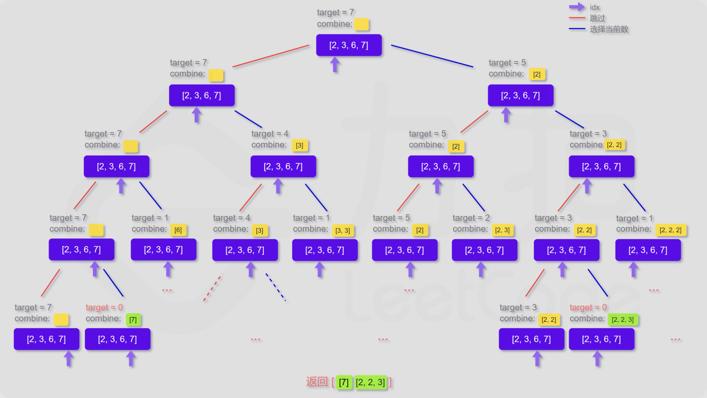

回溯算法是对树形或者图形结构执行一次深度优先遍历，实际上类似枚举的搜索尝试过程，在遍历的过程中寻找问题的解。
深度优先遍历有个特点：当发现已不满足求解条件时，就返回，尝试别的路径。此时对象类型变量就需要重置成为和之前一样，称为状态重置。

对于寻找所有可能组合的题目，都可以尝试递归+回溯的方法。对于递归+回溯可以先画出树形图

## 示例

### 1.【39. 组合总和】https://leetcode.cn/problems/combination-sum/
本题就是寻找所有和为target 的组合，其树形图：

对于candinates中的每个元素都有选和不选两种情况，所以就按照选和不选画出二叉树
~~~C++
class Solution {
public:
    void dfs(vector<int>& candidates, vector<vector<int>>& ans, vector<int>& combine, int target, int id){
		// 用id来遍历candinates
        if(target == 0){
            ans.push_back(combine);
            return;
        }
        if(id == candidates.size()){
            return;
        }
		// 如果不选id的元素，那么只需要把id+1，处理下个元素
        dfs(candidates, ans, combine, target, id+1);
		// 如果选择id的元素，首先判断是否满足条件
        if(target - candidates[id] >= 0){
            combine.push_back(candidates[id]);
            dfs(candidates, ans, combine, target - candidates[id], id);
			// 当id的元素处理完成后，一定需要把当前元素退出来，这里就是回溯的
			// 状态重置，就是回溯前一个元素。在这里是先处理【不选】的情况，比如6这
			// 个元素，在【不选】的情况中，处理7，发现7满足条件，所以combine=[7]。
			// 当【不选】的情况处理完成后，需要处理【选】的情况，要把【不选】6时候的处理结果清除掉，即把combine中的7退出，即进行pop_back()操作。
            combine.pop_back();
        }
    }

    vector<vector<int>> combinationSum(vector<int>& candidates, int target) {
        vector<vector<int>> ans;
        vector<int> combine;
        dfs(candidates, ans, combine, target, 0);
        if(ans.empty())
            return {};
        else
            return ans;
    }
};
~~~

### 2. 【40. 组合总和 II】https://leetcode.cn/problems/combination-sum-ii/
#### 解法一：超时了。对于测试用例：
[1,1,1,1,1,1,1,1,1,1,1,1,1,1,1,1,1,1,1,1,1,1,1,1,1,1,1,1,1,1,1,1,1,1,1,1,1,1,1,1,1,1,1,1,1,1,1,1,1,1,1,1,1,1,1,1,1,1,1,1,1,1,1,1,1,1,1,1,1,1,1,1,1,1,1,1,1,1,1,1,1,1,1,1,1,1,1,1,1,1,1,1,1,1,1,1,1,1,1,1]
30
重复遍历的太多。
~~~C++
    void dfs(vector<int>& cands, set<vector<int>>& map, vector<vector<int>>& ans, 
             vector<int>& combine, int target, int id){
        if(target==0){
            if(map.count(combine) == 0){
                ans.push_back(combine);
                map.insert(combine);
            }
            return;
        }
        if(id == cands.size()){
            return;
        }

        dfs(cands, map, ans, combine, target, id+1);
        if(target - cands[id] >= 0){
            combine.push_back(cands[id]);
            dfs(cands, map, ans, combine, target - cands[id], id+1);
            combine.pop_back();
        }
    }

    vector<vector<int>> combinationSum2(vector<int>& candidates, int target) {
        sort(candidates, 0, candidates.size() -1);

        set<vector<int>> map;
        vector<vector<int>> ans;
        vector<int> combine;
        dfs(candidates, map, ans, combine, target, 0);
        if(ans.empty())
            return {};
        else
            return ans;
    }
~~~

#### 解法二：
首先计算每个数字出现的次数。对于一个数字，假设出现cnt次，有【不选】和【选】。对于【不选】需要向后移动cnt个位置；对于【选】，需要遍历「1，cnt」次。
~~~C++
    void dfs(vector<int>& cands, unordered_map<int, int>& map, vector<vector<int>>& ans, 
             vector<int>& combine, int target, int id){
        if(target==0){
            ans.push_back(combine);
            return;
        }
        if(id == cands.size()){
            return;
        }

        int cnt = map[cands[id]];
        dfs(cands, map, ans, combine, target, id + cnt);
        for(int i = 1; i <= cnt; i++){
            if(target - cands[id] * i >= 0){
                for(int k = 0; k < i; k++)
                    combine.push_back(cands[id]);
                dfs(cands, map, ans, combine, target - cands[id] * i, id + cnt);
                for(int k = 0; k < i; k++)
                    combine.pop_back();
            }
        }
    }

    vector<vector<int>> combinationSum2(vector<int>& candidates, int target) {
        sort(candidates, 0, candidates.size() -1);
        unordered_map<int, int> map;
        for(auto& i:candidates)
            map[i]++;

        vector<vector<int>> ans;
        vector<int> combine;
        dfs(candidates, map, ans, combine, target, 0);
        if(ans.empty())
            return {};
        else
            return ans;
    }
~~~

### 3. 【47. 全排列 II】https://leetcode.cn/problems/permutations-ii/
~~~C++
class Solution {
public:
    void dfs(vector<vector<int>>& ans, vector<int>& nums, vector<int>& combine, vector<bool>& vis){
        if(combine.size() == nums.size()){
            ans.emplace_back(combine);
            return;
        }
        for(int i = 0; i < nums.size(); i++){
            if(i > 0 && nums[i] == nums[i-1] && !vis[i-1])
                continue;
            if(!vis[i]){
                combine.push_back(nums[i]);
                vis[i] = true;
                dfs(ans, nums, combine, vis);
                vis[i] = false;
                combine.pop_back();
            }
        }
    }

    vector<vector<int>> permuteUnique(vector<int>& nums) {
        sort(nums.begin(), nums.end());
        vector<vector<int>> ans;
        vector<bool> vis(nums.size(), false);
        vector<int> combine;
        dfs(ans, nums, combine, vis);
        return ans;
    }
};
~~~