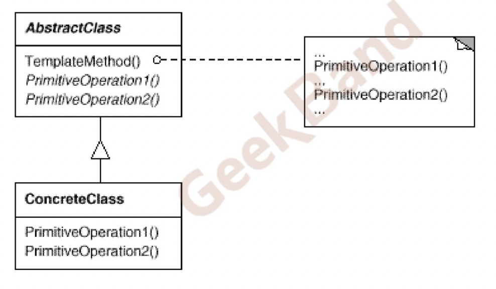

## 组件协作模式

组建协作模式通过晚绑定来实现框架与应用程序之间的松耦合，是这两者之间协作的常用模式。

典型的组建协作模式包括

1.  Template Method（模板方法）
2.  Strategy（策略模式）
3.  Observer/Event（

## Template Method

### 动机

在软件构建过程中，对于某一项任务，常常有稳定的整体结构，但各个子步骤却有很多改变的需求，或者由于固有的原因（比如框架和应用程序的关系）而无法和任务的整体结构同时实现。
如何在确定的整体结构前提下，来灵活应对各个子步骤的变化或晚期实现需求？

### 模式定义

定义一个操作中的算法的骨架（稳定），而将一些步骤延迟（变化）到子类中。Template method使得子类可以不改变（复用）一个算法的结构即可重定义（override重写）该算法的某些特定步骤

#### 具体来说：

函数的调用顺序（骨架函数）是固定的，其中的某些函数是程序库人员编写，另一些函数需要应用程序人员自定义，这样整个算法的骨架（函数的调用顺序）是稳定的。在这种情况下，程序库人员可以把骨架完成，把需要变化的函数定义成虚函数，由应用程序人员通过继承重写的方式完成。然后应用程序人员通过定义基类指针指向派生类对象，调用程序的骨架函数。

#### 示例1

```
// 程序库开发人员
class Library{
public:
        void step1(){...}
        void step3(){...}
        void step5(){...}
};
// 应用程序人员
class Applicatioin{
public:
        bool step2(){...}
        bool step4(){...}
};
int main(){
        Library lib;
        Application app;
        lib.step1();
        if(app.step2()){
                lib.step3();
        }
        for(int i = 0; i < 4; i++){
                app.step4();
        }
        lib.step5();
}
```

上面的程序中，程序库人员完成了step1/step3/step5，应用程序人员完成了step2/step4以及main函数中各个函数的调用方式。如果应用程序对函数的调用方式只能是这一种，那么由应用程序人员完成调用方式的代码，容易造成错误。

#### 示例2，应用template method方法

```
// 程序库人员
class Library{
private:
        void step1();
        void step3();
        void step5();
protected:
        virtual bool step2();
        virtual bool step4();
public:
        void run(){
                step1();
                if(step2()){
                        step3();
                }
                for(int i = 0; i < 4; i++){
                        app.step4();
                }
                lib.step5();
        }
};

//应用程序人员
class Application: public Library{
protected:
        virtual bool step2(){...}
        virtual bool step4(){...}
}
int main(){
        Library* lib = new Application();
        lib-> run()
        return 0;
}
```

这种方式，应用程序人员只需要完成step2/step4两个函数，然后在main函数中，通过动态绑定的方式，调用run函数即可。这样更不容易出错。

### 类图结构



### 要点总结

1.  为很多应用程序提供了灵活的扩展点（继承+虚函数），是代码复用方面的基本实现结构。
2.  除了可以灵活应对子步骤的变化外，提供了一种反向控制结构（类库的角度）：“不要调用我，让我来调用你”（虚函数的晚绑定机制）
3.  具体实现方面，被template method调用的虚函数可以提供实现，也可以没有任何实现（抽象方法，纯虚方法），但是一般推荐设置为protected 方法。