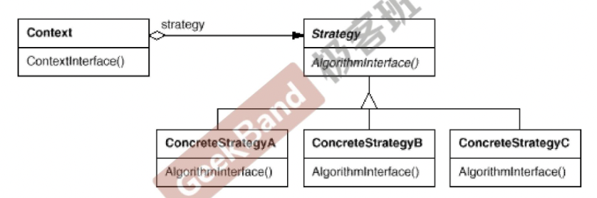

## 组件协作模式

组建协作模式通过晚绑定来实现框架与应用程序之间的松耦合，是这两者之间协作的常用模式。

典型的组建协作模式包括

1.  Template Method（模板方法）
2.  Strategy（策略模式）
3.  Observer/Event（

## strategy策略模式

### 动机

1.  在软件构件过程中，某些对象使用的算法可能多种多样，经常改变，如果将这些算法都编码到对象中，将会使对象变得异常复杂；而且有些时候支持不使用的算法也是一个性能负担。
2.  如何在运行时根据需要透明地更改对象的算法？将算法与对象本身解耦，从而避免上述问题？

### 模式定义

定义一些列算法，把它们一个个封装起来，并且使它们可互相替换（变化）。该模式使得算法可以独立于使用它的客户程序（稳定）而变化（扩展，子类化）

#### 示例1

```
enum TaxBase{
    CN_Tax,
    US_Tax,
    DE_Tax，
    FR_Tax // 变化点
}
class SalesOrder{
    TaxBase tax;
public:
    double CalculateTax(){
        if(tax == CN_Tax){...}
        else if(tax == US_Tax){...}
        else if(tax == DE_Tax){...}
        else if(tax == FR_Tax){...} // 变化点
        ...
    }	
}
```

当有新的需求时，比如需要加入法国的税率计算，那么在示例1中，就需要在枚举类型中增加一个法国税法的类型（变化点），然后在税率计算的函数CalculateTax()中，需要再加上一个else if语句。这里就违背了“开闭原则”，对扩展开放，对改变关闭。涉及到编译/测试等一些列问题。

#### 示例2: strategy模式

```
class TaxStrategy{
public:
    virtual double Calculate(const Context& context)=0;
    virtual ~TaxStrategy();
}

class CNTax: public TaxStrategy{
public:
    virtual double Calculate(const Context& context){...}
}

class USTax: public TaxStrategy{
public:
    virtual double Calculate(const Context& context){...}
}

class DETax: public TaxStrategy{
public:
    virtual double Calculate(const Context& context){...}
}

class FRTax: public TaxStrategy{ // 变化点
public:
    virtual double Calculate(const Context& context){...}
}

class SalesOrder{
private:
    TaxStrategy* strategy;
public:
    SalesOrder(StrategyFactory* strategyFactory){
        this->strategy = strategyFactory->NewStrategy();
    }
    ~SalesOrder(){
        delete this->strategy;
    }
    double CalculateTax(){
        Context context;
        double val = strategy->Calculate(context);
    }
}
```

当需要加入法国税率时，只需要写一个法国税率的类，SalesOrder类不需要变化，除了法国税率的类文件，其他文件都不需要更改。

### strategy模式结构



### 要点总结
1. strategy及其子类为组件提供了一些列可重用的算法，从而可以使得类型在运行时方便地根据需要在各个算法之间进行切换。
2. strategy模式提供了用条件判断语句以外的另一种选择，消除条件判断语句，就是在解耦合。含有许多条件判断语句的代码通常都需要strategy模式（除了条件组合绝对不变，比如一周七天等）
3. 如果strategy对象没有实例对象，那么各个上下文可以共享同一个Strategy对象，从而节省对象开销。