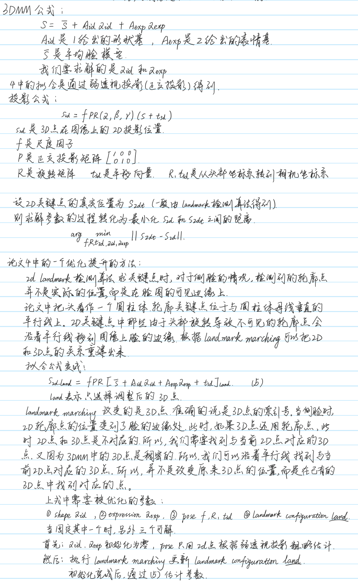

# 2022年面试——3DMM

# 3DMM

使用多个已经标定的相机，可以重建出世界坐标系下人脸的3D关键点。得到3D关键点之后，如何应用这些3D关键点。
假设这些3D关键点是在标定板坐标系下，各个相机与标定板的R，t已知。

1.  各个角度的2D facial landmark
    多个相机拍摄人脸，很容易得到大角度的人脸图像。大角度图像手动标注是很难标注准确的。现在利用重建3D关键点，可以投影到大角度的图像中，利用这样的数据，可以训练出大角度的landmark模型。
2.  精确的headpose
    利用重建出的关键点，可以得到准确的headpose（可以是3个自由度的headpose：yaw、roll、pitch，也可以是2个自由度的人脸朝向：yaw、pitch），通过标定板和相机的R、t，把headpose转换到相机坐标系中。这是一个非常精确的headpose，可以当作准确的label，训练headpose模型。
3.  提升视线的精度。
4.  3D facial landmark
    深度学习训练的3D facial landmark模型，不是直接训练关键点，而是训练的形状基和表情基的系数，然后通过这个系数拟合出3D facial landmark。
    现在训练数据是通过平均脸模型通过3DMM拟合出的系数，所以这个系数的精度不是很高。
    利用重建出来的3D关键点，可以利用3DMM重建，拟合出更加精确的形状基和表情基的系数，然后通过深度学习训练。

# 3DMM 弱透视投影到透视投影的推导

弱透视投影不考虑相机的参数，实际应用会带来精度损失，推导出透视投影可以提高精度
按照 zhangxiangyu 的推导流程，只需替换掉 pose 拟合、表情拟合、形状拟合三个部分。

## 1 pose 拟合

相比弱透视投影，变简单了，R、t 只需要 pnp 就可以计算出来

## 2 表情拟合、形状拟合

这两个拟合方法是相同的，重新推导公式
设相机内参矩阵为 K，旋转矩阵和平移向量为：R、t
2D 关键点为$\vec x=(u, v, 1)$， $S_{mean}$ 为是标准3D 点
拟合公式变为：

$$
S_{2d} = K[R(S_{mean} + A_{id}\alpha_{id} + A_{exp}\alpha_{exp}) + t]

$$

可以直接求解解析解
为了公式表示方便，假设$R(S_{mean} + A_{id}\alpha_{id} + A_{exp}\alpha_{exp}) + t$已经在归一化平面上了
拟合表情参数时，固定 $R、t、\alpha_{id}$，则：

$$
R(S_{mean} + A_{id}\alpha_{id} + A_{exp}\alpha_{exp}) + t \\ 
=R(S_{mean} + A_{id}\alpha_{id}) + t  + RA_{exp}\alpha_{exp} 
=t_{3d} + E\alpha_{exp}

$$

$$
\Rightarrow 
\left[\begin{matrix}
x_s \\ y_s \\ z_s
\end{matrix}\right] + 
\left[\begin{matrix}
x_e \\ y_e \\ z_e
\end{matrix}\right] \alpha_{exp} = 
\left[\begin{matrix}
x_s + x_e\alpha \\ y_s + y_e\alpha \\ z_s + z_e\alpha
\end{matrix}\right] \\
转到归一化平面为  {\Rightarrow }
\left[\begin{matrix}
\frac{x_s + x_e\alpha}{z_s + z_e\alpha} \\ 
\frac{y_s + y_e\alpha}{z_s + z_e\alpha} \\ 
1
\end{matrix}\right] 

$$

$$
则 \left[\begin{matrix}
u\\ v \\ 1
\end{matrix}\right] = 
K\left[\begin{matrix}
\frac{x_s + x_e\alpha}{z_s + z_e\alpha} \\ 
\frac{y_s + y_e\alpha}{z_s + z_e\alpha} \\ 
1
\end{matrix}\right] \Rightarrow 
K^{-1}\left[\begin{matrix}
u\\ v \\ 1
\end{matrix}\right] = 
\left[\begin{matrix}
\frac{x_s + x_e\alpha}{z_s + z_e\alpha} \\ 
\frac{y_s + y_e\alpha}{z_s + z_e\alpha} \\ 
1
\end{matrix}\right] 

$$

$$
设：K^{-1}\left[\begin{matrix}
u\\ v \\ 1
\end{matrix}\right] = \left[\begin{matrix}
x_n \\ y_n \\ 1
\end{matrix}\right] \\
\Rightarrow 
\left[\begin{matrix}
x_n \\ y_n \\ 1
\end{matrix}\right] = 
\left[\begin{matrix}
\frac{x_s + x_e\alpha}{z_s + z_e\alpha} \\ 
\frac{y_s + y_e\alpha}{z_s + z_e\alpha} \\ 
1
\end{matrix}\right] 

$$

$$
两边乘以 z_s + z_e\alpha，得到：\\
z_s\left[\begin{matrix}
x_n \\ y_n \\ 1
\end{matrix}\right] + 
z_e\alpha \left[\begin{matrix}
x_n \\ y_n \\ 1
\end{matrix}\right] = 
\left[\begin{matrix}
x_s + x_e\alpha \\ y_s + y_e\alpha \\ z_s + z_e\alpha
\end{matrix}\right] = 
\left[\begin{matrix}
x_s \\ y_s \\ z_s
\end{matrix}\right] + 
\left[\begin{matrix}
x_e\alpha \\ y_e\alpha \\ z_e\alpha
\end{matrix}\right]

$$

这样，就把 z 乘到了2d 点上

$$
\left[\begin{matrix}
z_sx_n - x_s \\ z_sy_n - y_s \\ z_s - z_s =0
\end{matrix}\right] = 
\left[\begin{matrix}
x_e - z_ex_n \\ y_e - z_ey_n \\ z_e - z_e =0
\end{matrix}\right] \alpha

$$

$$
设 A=\left[\begin{matrix}
z_sx_n - x_s \\ z_sy_n - y_s \\ 0
\end{matrix}\right], 
b=\left[\begin{matrix}
x_e - z_ex_n \\ y_e - z_ey_n \\ 0
\end{matrix}\right] \\
\Rightarrow A\alpha = b \\
\Rightarrow A^TA\alpha = A^Tb \\
\Rightarrow (A^TA + \lambda reg)\alpha = A^Tb \quad 系数加上正则项 \\
\Rightarrow \alpha = (A^TA + \lambda reg)^{-1}A^Tb

$$

同理，可以推导出形状参数$\alpha_{id}$

# 原始3DMM 公式
3DMM的一些论文：
1. A Morphable Model For the Synthesis of 3D Faces
2. A 3D Face Model for pose and illumination invariant face recognition
3. Face recognition based on fitting a 3D morphable model
4. High-Fidelity pose and expression normalization for face recognition in the wild
其中1和2奠定了3d人脸的基础，3是对1的改进应用，4对3d和2d匹配做了优化
