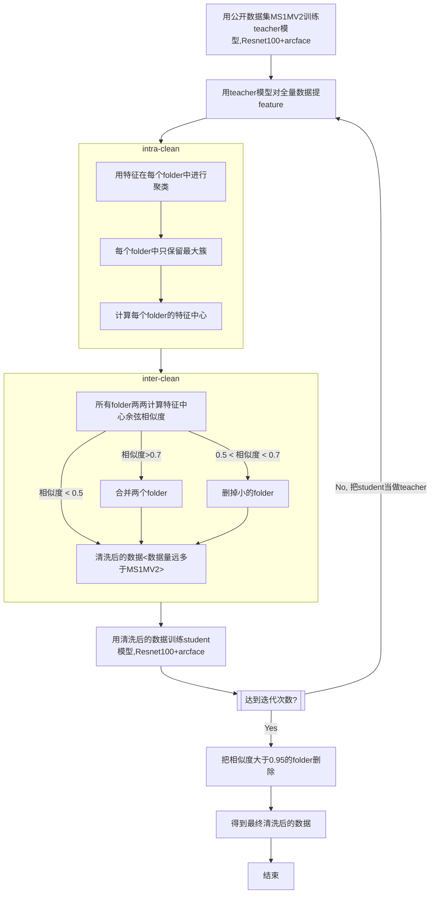
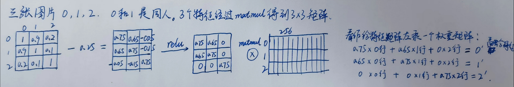
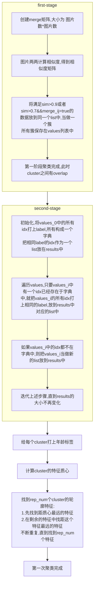
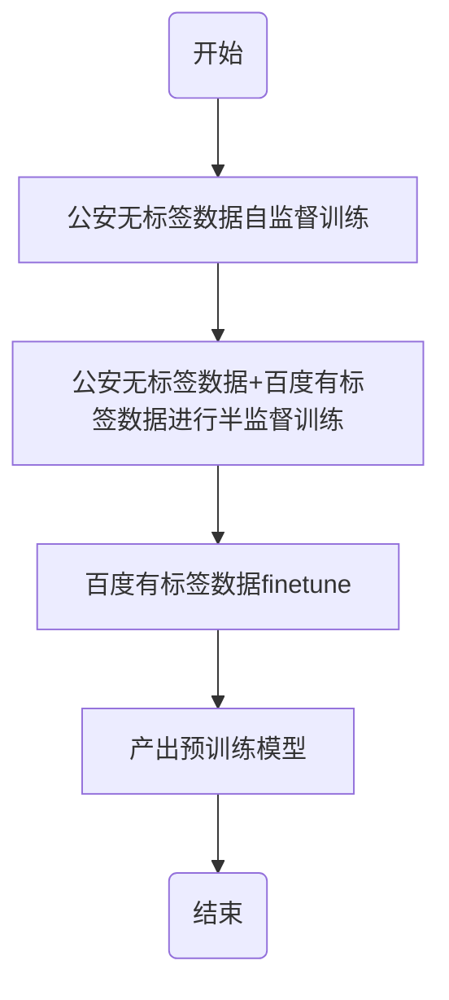

# 2022年面试——简历知识点总结

## 1\. 数据清洗

### WebFace260M数据清洗方法：



## 2\. 口罩比赛

### 2.1 评测方法

- 一张证件照、一张戴口罩的抓拍照
- 测试集已经crop、align，大小为112，不能二次对齐
- 1比1评测，用far 1e-5下的tar作为评价指标
- 每天13:30提交一次模型，平台17:00发布结果

### 2.2 模型要求

- 训练集：MS1M-v3（ID数：93430，图片数：5179510，外国人居多），不能用预训练模型
- 可以自定义口罩增强方法，口罩模板数量不超过10张
- 特征维度不超过512
- onnx格式模型，模型参数为FP32类型，大小不超过1GB，速度在15ms以内

### 2.3 训练策略

- Baseline
    - iresnet101 + 512dim + CosFace
    - 业务中常用的数据增强
- 评测方法：
    
    | 模块  | 有效  | 无效  |
    | --- | --- | --- |
    | 测试方法 | 注册多个账号，直接官网评测 | 构建内部数据集（与官方测试结果无法对齐） |
    | 数据增强 | 1.数据缩放增强：0.611->0.623<br>2.motion blur增强：0.64->0.644 | 旋转增强、高斯噪声 |
    | 调节人种比例 |     | 1.增大亚洲人比例<br>2.去掉黑人 |
    | 口罩增强 |     | 1.基于关键点调节口罩位置<br>2.随机扰动口罩位置<br>3.增大口罩概率<br>4.口罩纹理<br>5.更多口罩模板 |
    | 数据清洗 | 去掉类间噪声：0.623->0.632 | 去掉类内噪声 |
    | Backbone<br>Baseline:iresnet101 | 1\. iresnet101<br>2.输入112 resize到144：0.623->0.632 | iresnet154(微弱提升，耗时超标)<br>iresnet101 + SE结构<br>FPN多层特征融合<br>Transformer |
    | 模型优化Baseline<br>lr:cosine LR<br>epoch:30 | 1\. epoch=60(0.544->0.582)<br>先用CosFace训练，再用CosFace+DCQ训练：0.688->0.705 | arcface loss<br>dynamic margin<br>先用CosFace，再用DCQ训练 |
    | 模型融合 | 1.测试时加上翻转图像特征：0.585->0.603<br>2.测试时加上口罩图像特征：0.612->0.615<br>加入多尺度金字塔特征（提升微弱，耗时加大）<br>全图和半图融合，共享33层，分两阶段训练：0.628->0.638 |     |
    | 域迁移技术 | 1.GN、IBN、IN等归一化方法（onnx不支持）<br>2.戴口罩和不戴口罩FC层分离建模：0.614->0.628 | DAL方法 |
    | fintune策略:<br>在前一天最好的模型上finetune | 1.用linear warmup将学习率提升10倍<br>2.cosine lr进行学习率下降<br>3.调节epoch数或每个epoch迭代数，一天完成训练 |     |
    

### 2.4 后期trick

得知主办方为了加速测试，以batch的形式提取特征
假设一个人的多张图片在batch内，计算batch内图片两两相似度，那么同一人的图片相似度会很高。
设置一个阈值，相似度大于阈值，认为可能是同一个人，对这些特征按照相似度进行融合。

```
similarity_thresh = 0.25
out_norm = nn.functional.normalize(x, dim=1)
affinity = torch.matmul(out_norm, torch.transpose(out_norm, 0, 1))
affinity = torch.relu(affinity - similarity_thresh)
out = torch.matmul(affinity, x)
x = out
```

如下图


## 3. 一人一档
聚类分两种情况：
1. 新数据和新数据聚类：每天抓拍的数据进行聚类
2. 新cluster和老cluster一起聚类：把每天聚好的cluster与历史中已经形成的档案进行聚类。

### 3.1 新数据和新数据聚类
新数据聚和新数据聚类是把每天抓拍的数据进行聚类。
#### 第一次聚类：


#### 第二次聚类
真正大数据量聚类时，是需要把数据划分到不同的节点处理的。当不同节点处理完聚类，形成cluster后，还需要对这些cluster进行聚类。这就是第二次聚类。
同样需要merge矩阵，表示对哪些cluster进行合并。
**merge矩阵的计算方法**：
1. 判断一个cluster是否锁定：只要cluster i锁定，那么所有和它相关的cluster都不与它进行聚类。
**锁定的判断方法**：当cluster太松散，则锁定。松散的条件：轮廓点之间的最小相似度(avg_sim_reps)小于阈值1，或者所有轮廓点到质心的平均相似度(avg_sim_mean_rep)小鱼阈值2。阈值1和2的设定都与年龄有关：
**年龄为mid**：avg_sim_reps < lock_rep_mid(0.3) && avg_sim_mean_rep < lock_mean_rep_mid(0.6)
**年龄不是mid**：avg_sim_reps < lock_rep_old(0.5) && avg_sim_mean_rep < lock_mean_rep_old(0.7)

2. 如果两个cluster之间比较松散，则不merge。松散的条件有两个：
	1. cluster i 和cluster j 的轮廓点之间的最小相似度avg_sim_rep_new小于某个阈值
	2. 两个cluster质心相似度merge_score小于某个阈值。
	
	阈值的设定同样需要根据年龄判断
	**年龄为mid**：merge_score < 0.71 or avg_sim_rep_new < prelock_rep_old(0.55) and merge_score < 0.75:  merge[i, j] = False
	**年龄不是mid**：avg_sim_rep_new < lock_thresh(0.6) and merge_score < 0.6：merge[i, j] = False.
	除了merge矩阵和相似度阈值（采用0.6）不同外，其他的聚类方法与第一次聚类相同。
	
经过第一次聚类和第二次聚类，新数据聚类完成。

### 3.2 新数据和老数据聚类
把每天聚好的cluster与数据库中的cluster进行聚类。这个聚类过程中，每天生成的cluster之间不需要聚类。

### 3.3 以图搜当的后处理逻辑：
实际检索过程中，输入一张图，理想情况返回一个档案。但是因为阈值设置以及聚类过程的误差，会返回多个档案。由于模型精度和聚类误差，可能存在几个档案对应的是同一个人，这种称为**散档**.
一个档案中的图片存在一些图片不是同一个人时，称为**混档**.
针对检索的散档和混档，采用**后处理策略**：
1. **散档合并**：对超过阈值的档案的封面照提取特征，进行single-linkage聚类，合并档案，并根据封面照求质心，计算质心与query的分数，返回topK的档案
2. **混档处理**：对topK新档案进行新模型特征提取，基于新特征采用single-linkage聚类，保留最大簇。混档处理完毕后，需要重新计算质心，并根据和query得分重新排序。

### 3.4 聚类方法存在的问题
1. 第一次聚类的第二个阶段使用的方法是single-linkage算法，两个cluster只要有一个数据相同，就进行合并。由于导致链式效应，导致档案越来越大。
解决方法：采用**锁档**的策略进行缓解。
2. 锁档策略和merge矩阵中阈值的设置比较主观。
解决方法：在测试集上采用暴力搜索的方法找到合适阈值。

## 4. 视线估计算法
### 4.1 算法的技术背景
这里的视线，就是当我们一个具体的物体时，从眼睛发出的一条指向物体的射线，这条射线可以通过三维向量表示。由于我们是通过相机采集的图像来预测这个向量，所以我们最终在相机坐标系中表示这个向量。
大体有两种方法来估计视线：一个是基于model的方法，另一个是appearance的方法，现在一般采用深度学习来做。基于model的方法需要重建出眼睛的几何模型，计算出眼睛的参数，从而根据几何的方法得到视线向量。在这个项目中，我们使用的是appearance的方法，从一张面部图片直接判断视线向量。
一般涉及到深度学习，就需要在数据上投入大量精力。
### 4.2 数据采集方法和处理方法
我在做视线项目，使用了不同的方法采集数据。
1. 开始的时候，借鉴了一些开源论文中的方法。我在屏幕的周围分别固定上几个相机，然后标定出相机和屏幕的关系，这样屏幕上的每个点就可以在相机坐标系中表示出来，在屏幕上随机的显示一些点，作为视线的终点。然后，对于相机拍摄的每张照片，检测人脸的2D landmark，然后使用一个平均脸的3D landmark，通过pnp算法，得到平均脸的坐标系到相机坐标系的转换，然后把3D landmark转换到相机坐标系，我们可以得到眼睛在相机系下的关键点，把这个点作为起点，终点减起点，就得到了视线向量。通过这种方法采集到的数据，得到了第一版模型，这个模型的精度和一些论文中的精度基本是一致的，误差4度左右。在采集过程中，为了保证数据的准确，在采集的过程中进行判断。这种方法存在几个问题：一个是视线的范围有限，所有的数据只是屏幕这么大的范围。另一个是，在计算label的时候，采用了平均脸的3D点，和pnp的方法，这里在label上引入了很大的误差。这也是几个视线公开数据集的问题：数据量少，视线范围窄，label精度不高。
2. 然后我就改进采集的方法。使用9个固定相机和一个移动相机拍摄人脸和一个标定板，标定板用来标定十个相机的外参。在拍摄的时候，要求被拍的人盯着移动相机的中心，这个移动相机被当做视线的终点。对十个相机的图像检测2D landmark，然后重建对应的3D关键点。这些3D关键点是针对每个人重建的，所以精度很高。这样就得到了视线的起点，所以视线的向量也就得到了。为了采集各个角度的数据，九个固定相机围绕人头上下左右摆放，移动相机每移动到一个位置，就固定住，然后人看向这个相机，各个方向转头。我通过二维直方图的方式分别统计了视线的分布和headpose的分布，根据统计的分布情况，再决定补录哪些角度的数据。通过这种方式，我们得到了大量的数据，而且label的精度很高，角度分布也很广。
		数据规范化。因为采集的数据，相机与人的距离是任意的，人的headpose也是任意的，这就都增加了训练的复杂性，需要考虑6自由度的headpose。所以，需要对数据进行规范化处理，降低解空间的维度。原理就是通过对相机进行旋转和平移，把相机调整到一个虚拟的位置（统一的球面上），使得不同位置相机坐标系和人头坐标系之间的旋转平移一致，即与人的距离固定，同时，相机光轴穿过人眼的中心，相机的x轴与人头坐标系的x轴在一个平面上。然后，把视线向量转换成水平角和竖直角。
### 4.3 算法设计
获得数据之后，在训练时，采用多任务的方式，同时训练视线角度、headpose、person id、置信度。其中视线和headpose是有关联的；加入person id，是因为人眼的参数是因人而异的；置信度其实回归的是一个方差，把gt看做狄拉克分布，预测看做高斯分布，预测的结果当做期望，用KL散度作为两个分布的loss。
	针对延锋项目，额外增加了一个分类任务，对视线是否落在屏幕上进行二分类。
	
### 4.4 遇到的难点
1. 眼睛被遮挡
	- 增加眼睛被遮挡的数据，把两只眼睛的label设置为未遮挡眼睛的label
	- 加入是否被遮挡的训练任务分支
2. 眼镜反光
	- 增加戴眼镜数据
	- 合成光斑的数据

## 5 大规模数据+transformer半监督得到预训练模型，通过蒸馏产出部署模型
### 5.1 大规模数据
公安系统中的数据：20亿图片用于自监督训练
百度厂内数据：800万id、4000万图片用于监督训练
### 5.2 预训练模型的训练过程
基于自研的人脸识别训练框架DCQ，先用公安系统中的数据进行自监督训练，然后加入百度厂内的数据进行半监督训练，最后只在百度厂内数据上进行训练，产出预训练模型。

### 5.3 离线蒸馏
预训练大模型的结构、小模型的结构
蒸馏方法：DKD(解耦的知识蒸馏)
#### 预训练大模型Deit-p4
1. 训练时间：20天，机器：4台V100

#### 蒸馏小模型 Deit-p8：
1. img_size=112
2. patchsize = 8
3. embed_dim = 1024
4. depth=12
5. num_heads=16


batch shuffle的作用
