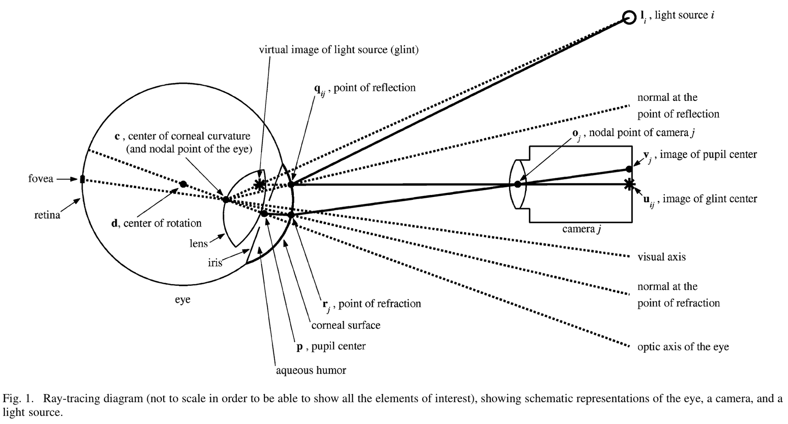

# 2022年面试——视线估计知识点
# appearance-based 方法
## 1 实现流程
**已知**：
1. 8个固定相机S_cam和1个移动相机M_cam在标定板系下的R，t
2. 人脸2d关键点 2D_landmark

**求解**：
3D_landmark	人脸法向量	head的yaw/pitch角	相机系下yaw/pitch	head系下yaw/pitch
**步骤**
1. 数据准备
	1. 8个S_cam拟合出标定板系下的3D_landmark
	2. 在标定板系中拟合出人脸平面，并求其法向量face_normal
	3. 根据R、t把face_normal转换到相机系
	4. 计算视线向量：
			终点：标定板系下的M_cam的坐标
			起点：标定板系下两只眼睛的瞳孔点
			转换到固定相机系中，计算gaze：gc
	5. 根据相机系中的3D_landmark做normalization，计算出变换矩阵R
		对图像进行crop，得到face、left eye、right eye
		把face_normal、gc转换到虚拟相机系下，得到face_normal_vir、gc_vir
	6. 根据face_normal_vir计算出yaw_h、pitch_h，并恢复出新的头部pose：Rh
		根据gc_vir计算出yaw_gc、pitch_gc
	7. 根据Rh把gc_vir转换到新的头坐标系中：gh_vir=R_h^(−1)∗gc_vir，并计算出yaw_gh、pitch_gh
2. 训练预处理
		a. 图像水平翻转，视线和头的yaw角需要加负号
		b. 图像裁剪/移动/模糊
3. 需要保存的数据
		a. 相机坐标系下的3D关键点
		b. 相机坐标系下的视线向量
		c. 相机坐标系下的face的法向量（可以不存）
		d. normalize之后的图像face、eyes
		e. virtual camera系下的head角度（在virtual camera系下拟合face平面，计算法向量）
		f. virtual camera系下的视线角度
		g. head系下的视线角度

## 2. Normalize过程
1. vector转angle   angle转vector
	vector = [a, b, c].      angle = [pitch, yaw]
	**vec2angle**:
	pitch = arcsin(-b)
	yaw = arctan(-a, -c)
	
	**angle2vec**:
	论文中原始的公式：
	a = -cos(pitch) * sin(yaw)
	b = sin(pitch)
	c = -cos(pitch) * cos(yaw)
	但是在vector转angle的时候，是对b取负然后又求的的pitch，所以在angle2vec的时候，pitch也需要先取负，然后再计算。
	a = -cos(-pitch) * sin(yaw)
	b = sin(-pitch)
	c = -cos(-pitch) * cos(yaw)
	
2. 头和视线的方向问题
	定义头的朝向的时候，使用的是人脸平面的法向量。法向量通过人脸关键点拟合得到，代码中对拟合得到的法向量做了一步后处理，
	if(NormalVector.z > 0) NormalVector *= -1;
	这个操作导致法向量与头的中心点与鼻尖的连线的方向相反（通过debug代码得出的结论）

# model-based 方法步骤

1. 计算光源在角膜上反射点的空间
	根据两幅图像上的光斑glint，以及两个相机的内外参，可以直接通过三角化的方法得到光斑的空间坐标（相机坐标系中）。在求出这个空间坐标后，代码中又接着做了一些操作：给这个坐标向量加上了一个角膜曲率半径R的一半（猜测：我们从图中看到，光斑的反射点为q，而实际上，因为眼睛的表面类似镜子，通过三角化计算得到的光斑的位置不是q点的位置，而是图中virtual image of light source（glint）处的坐标。而我们实际想得到的是q点的坐标。所以此处加上了曲率半径的一半（这个距离应该也是一个近似的距离），因为z的方向相反，所以其实是把求出的z值向着相机的方向移动）。
2. 计算角膜曲率中心的空间坐标
	根据入射角等于反射角，所以入射线和反射线关于反射点q处的法线对称。我们现在已知反射线的向量，再计算出入射线的向量，就可以求出法线向量了。因为我们知道光源相对于相机的位置（事先量出来的，算是系统标定的一部分），所以入射线的向量也可以表示出来。两个向量相加即可得到法线的向量，法线是穿过角膜曲率中心的。所以，在反射点q的基础上加上沿着法线方向的半径，就得到了角膜曲率中心在相机坐标系下的位置。
3. 计算瞳孔中心的虚像点的空间坐标
	因为角膜的折射，在相机上成像的其实是瞳孔在角膜上的折射点r（这里与光斑的虚像点区分），这个点可以直接通过三角化得到。
	然后，把三角化求出来的瞳孔位置进行调整，使其更接近真实瞳孔的位置。优化的策略是沿着r点和相机中心连线的方向进行调整。使用nlopt库进行优化，因为是沿着直线方向进行调整，我们可以知道直线的方向向量，所以只需要计算出向量的系数。
	已知：
		a. 角膜曲率中心坐标c
		b. 角膜曲率中心c与真实瞳孔的距离的经验值K（代码中为vK）
		c. 三角化计算出来的瞳孔位置r（瞳孔在角膜上的折射点，代码中为vp_svd）
		d. 可以计算出r和相机直线的方向向量vec = vp_svd / ||vp_svd||
	优化目标:
		arg min_x⁡〖{(|(|(vp_svd+x∗vec)−c|)|  −vK)^2}〗
	这里用到角膜曲率中心到瞳孔中心的经验值vK = 4.8.
4. 计算光轴
	已知了角膜曲率中心和瞳孔中心的空间坐标，就可以求出光轴的向量了。
5. 根据光轴，以及先验的光轴和视轴夹角，就可以近似得到视轴的向量。
6. 根据视轴的向量和角膜曲率中心在屏幕坐标系中的坐标，可以求出视轴与屏幕的交点。
7. 然后标定vk：角膜曲率中心与瞳孔中心的距离
	代码中，计算的不是屏幕上的目标点和视点之间的误差，计算的是左图的左眼在屏幕上的视点与右图的左眼在屏幕上的视点之间距离dl，以及左图的右眼在屏幕上的视点与右图的右眼在屏幕上的视点之间距离dr，总的误差记为dl+dr，这里的dl和dr是一范数，可以优化出左眼的K（vK）和右眼的K（vK）。
	之所以是dl和dr，是因为在前面已经对数据进行了一次筛选，去掉了偏差较大的数据。
8. 标定光轴与视轴的夹角。
	用两个点标定夹角。
	已知：屏幕坐标系下
		a. 角膜曲率中心c
		b. 屏幕上的目标点
		c. 光轴
	目标：视轴与光轴在水平和竖直两个方向的夹角。
	这里优化的思想其实是用的平均法，或者说是用的聚类的方法。首先求出了所有参与计算的图像数据中，角膜曲率中心的中位数c_mid，然后求出光轴的中位数optic_mid。通过屏幕的目标点por，可以计算出视轴visual: por-c_mid,然后把向量转换成水平和竖直的角度，直接计算出visual_angle和optical_angle之间的差，当作kappa角。最后把两个点计算出的kappa角取平均。

以上是整个标定的过程。
标定完成之后，进行视线估计时，就可以调用上面优化出的参数
双相机单光源相对于单相机双光源的好处：
	1. 单光源只需要在角膜上反射一个光斑，而双光源需要同时反射两个光斑，显然一个光斑更容易获得。
	2. 头部活动范围更大。

	
	
	
